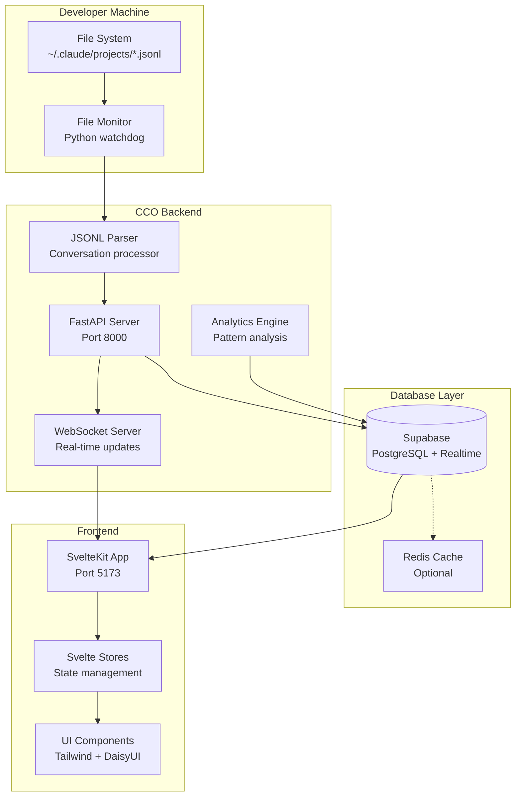
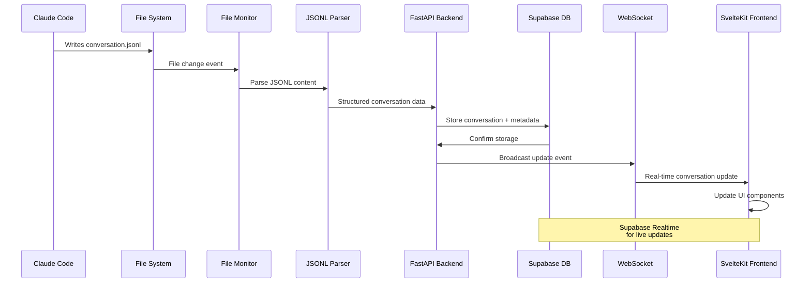
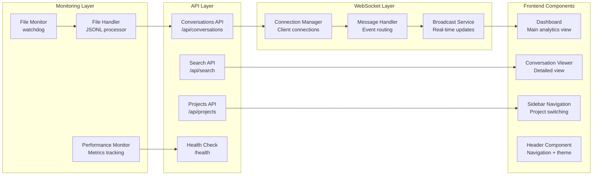
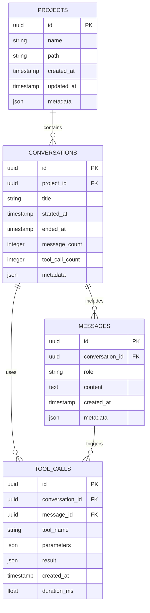
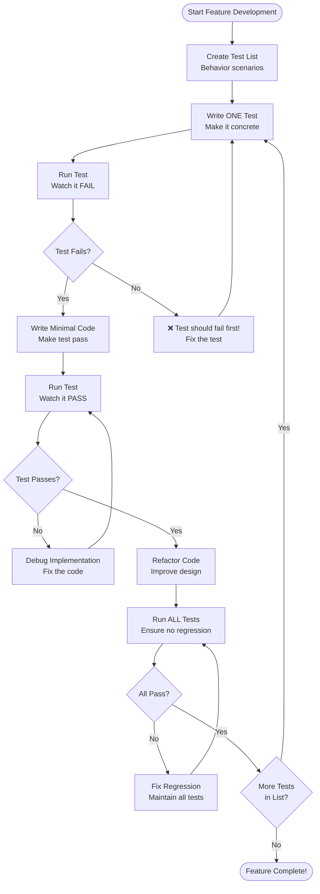
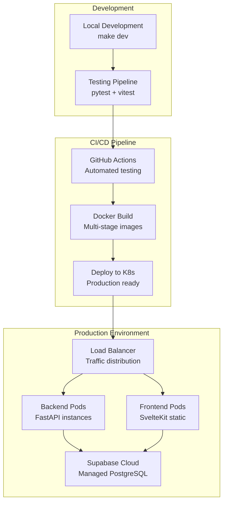

# Claude Code Observatory

<div align="center">


**The definitive observability platform for Claude Code interactions**

[](https://opensource.org/licenses/MIT)
[](https://www.python.org/)
[](https://kit.svelte.dev/)
[](https://supabase.com/)

</div>

## 🎯 Overview

Claude Code Observatory (CCO) provides complete conversation visibility, real-time monitoring, and actionable insights for developers and teams using Claude Code. The system monitors `~/.claude/projects/` directory to parse JSONL transcript files and provide comprehensive analytics.

### Key Features

- **100% Conversation Capture** - Complete visibility into Claude Code interactions
- **Real-time Monitoring** - Live updates via WebSocket connections
- **Zero Configuration** - Automatic project discovery and setup
- **Advanced Analytics** - Insights into conversation patterns and tool usage
- **Team Collaboration** - Share insights and learn from development patterns

## 🏗️ Technology Stack

### Backend (Python)
- **Framework**: FastAPI with async/await support
- **Database**: Supabase (managed PostgreSQL)
- **File Monitoring**: Python `watchdog` for cross-platform file system watching
- **WebSocket**: Native FastAPI WebSocket support
- **Testing**: pytest with comprehensive coverage (80-90% target)
- **Container**: Docker with multi-stage builds

### Frontend (SvelteKit + TypeScript)
- **Framework**: SvelteKit with TypeScript
- **Styling**: Tailwind CSS + DaisyUI components
- **Build Tool**: Vite for fast development and building
- **Testing**: Vitest for unit testing, Playwright for E2E
- **State Management**: Svelte stores with Supabase Realtime
- **Accessibility**: WCAG 2.1 AA compliance with comprehensive a11y features

### Database & Infrastructure
- **Primary Database**: Supabase (PostgreSQL with real-time subscriptions)
- **Authentication**: Supabase Auth with JWT tokens
- **Real-time**: Supabase Realtime + WebSocket for live updates
- **File Storage**: Local file system monitoring
- **Deployment**: Docker + Kubernetes, GitHub Actions CI/CD

### Development Methodology
- **TDD**: Canon TDD approach with disciplined test-first development
- **Testing**: 80-90% code coverage with performance benchmarks
- **Quality**: ESLint, Prettier, Pylint, Black formatting
- **Monitoring**: Real-time performance monitoring with <100ms file detection latency

## 🚀 Quick Start

### Prerequisites

- Python 3.11+
- Node.js 18+
- Docker & Docker Compose
- Supabase CLI (optional, for local development)

### Installation

1. **Clone the repository**
   ```bash
   git clone https://github.com/osbornesec/ccobservatory.git
   cd ccobservatory
   ```

2. **Start all services**
   ```bash
   make dev
   ```

3. **Or start individual services**
   ```bash
   # Backend (Python FastAPI)
   make dev-backend
   
   # Frontend (SvelteKit)
   make dev-frontend
   
   # Local Supabase (optional)
   make dev-supabase
   ```

4. **Access the application**
   - Frontend: http://localhost:5173
   - Backend API: http://localhost:8000
   - API Documentation: http://localhost:8000/docs

### Environment Setup

Copy the environment template and configure:

```bash
# Backend
cp backend/env.template backend/.env

# Frontend (if needed)
cp frontend/.env.example frontend/.env
```

## 📁 Project Structure

```
claude-code-observatory/
├── backend/                    # Python FastAPI backend
│   ├── app/                    # Main application
│   │   ├── api/                # HTTP API endpoints
│   │   ├── monitoring/         # File system monitoring
│   │   ├── database/           # Database layer (Supabase)
│   │   ├── websocket/          # WebSocket server
│   │   └── analytics/          # Conversation analysis
│   ├── tests/                  # Backend tests (pytest)
│   └── requirements.txt        # Python dependencies
├── frontend/                   # SvelteKit frontend
│   ├── src/
│   │   ├── routes/             # SvelteKit file-based routing
│   │   ├── lib/                # Shared components and utilities
│   │   │   ├── components/     # Svelte components
│   │   │   ├── stores/         # Svelte stores
│   │   │   └── api/            # API client
│   │   └── app.html            # HTML template
│   ├── static/                 # Static assets
│   └── package.json            # Node.js dependencies
├── supabase/                   # Supabase configuration
│   ├── migrations/             # Database migrations
│   └── config.toml             # Supabase settings
├── docs/                       # Comprehensive documentation
└── scripts/                    # Build and deployment scripts
```

## 🧪 Testing & Development

### Backend Testing (Canon TDD)
```bash
# Run all backend tests
make test-backend

# Run with coverage
make test-coverage

# Run specific test file
pytest backend/tests/test_file_monitor.py -v

# Performance benchmarks
make test-performance
```

### Frontend Testing
```bash
# Run all frontend tests
make test-frontend

# Unit tests (Vitest)
npm run test

# E2E tests (Playwright)
npm run test:e2e

# Test coverage
npm run test:coverage
```

### Development Workflow

The project follows **Canon TDD** methodology:

1. **Test List** - Create comprehensive test scenarios
2. **Write One Test** - Pick exactly one test and make it concrete
3. **Make It Pass** - Write minimal code to pass the test
4. **Refactor** - Improve design while maintaining tests
5. **Repeat** - Continue until feature complete

### Code Quality

```bash
# Lint and format
make lint                  # All components
make lint-backend         # Python (black, pylint)
make lint-frontend        # TypeScript (eslint, prettier)

# Type checking
make typecheck            # All components
make typecheck-backend    # Python (mypy)
make typecheck-frontend   # TypeScript (tsc)
```

## 📊 System Architecture

### High-Level Architecture



### Data Flow Architecture



### Component Interaction Map



### Database Schema Overview



### Development Workflow (TDD)



### Deployment Architecture



### Core Components

1. **File Monitor** - Python watchdog monitors `~/.claude/projects/**/*.jsonl`
2. **FastAPI Backend** - Processes JSONL files, stores in Supabase
3. **SvelteKit Frontend** - Real-time dashboard with Supabase Realtime
4. **Analytics Engine** - Conversation pattern analysis and insights

## 🚢 Deployment

### Production Deployment

```bash
# Build production images
make build

# Deploy to Kubernetes
make deploy-prod

# Or deploy with Docker Compose
docker-compose -f docker-compose.prod.yml up -d
```

### Environment Variables

Key configuration variables:

```bash
# Backend (.env)
SUPABASE_URL=your_supabase_url
SUPABASE_ANON_KEY=your_anon_key
SUPABASE_SERVICE_ROLE_KEY=your_service_key
CLAUDE_PROJECTS_PATH=~/.claude/projects

# Frontend (.env)
PUBLIC_SUPABASE_URL=your_supabase_url
PUBLIC_SUPABASE_ANON_KEY=your_anon_key
```

## 📈 Performance Targets

- **File Detection Latency**: <100ms (95th percentile)
- **UI Response Time**: <200ms for user interactions
- **System Uptime**: 99.9% availability
- **WebSocket Updates**: <50ms latency
- **Concurrent Monitoring**: 1000+ files
- **Test Coverage**: 80-90% across all components

## 🤝 Contributing

1. **Fork the repository**
2. **Create a feature branch** following Canon TDD methodology
3. **Write tests first**, then implement features
4. **Ensure all tests pass** and coverage requirements are met
5. **Submit a pull request** with comprehensive description

### Development Setup

```bash
# Install dependencies
make install

# Setup development environment
make setup-dev

# Run development servers
make dev

# Run tests continuously during development
make test-watch
```

## 📝 License

This project is licensed under the MIT License - see the [LICENSE](LICENSE) file for details.

## 🆘 Support

- **Documentation**: [Full documentation](./docs/README.md)
- **Issues**: [GitHub Issues](https://github.com/osbornesec/ccobservatory/issues)
- **Discussions**: [GitHub Discussions](https://github.com/osbornesec/ccobservatory/discussions)

---

<div align="center">

**Built with ❤️ for the Claude Code community**

[Documentation](./docs/README.md) • [Contributing](./CONTRIBUTING.md) • [Changelog](./CHANGELOG.md)

</div>