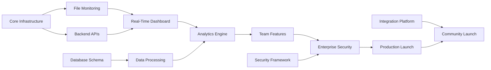

# 🗺️ Phase Breakdown - Claude Code Observatory

## 📅 **24-Week Project Timeline Overview**

### **Master Schedule**

```
Timeline Overview: Claude Code Observatory Development (24 Weeks)

Phase 1: Foundation & MVP (Weeks 1-8)
├── Sprint 1: Core Infrastructure (Weeks 1-2)
├── Sprint 2: File Monitoring System (Weeks 3-4)
├── Sprint 3: Basic Dashboard (Weeks 5-6)
└── Sprint 4: Integration & Testing (Weeks 7-8)

Phase 2: Enhanced Features & Analytics (Weeks 9-16)
├── Sprint 5: Advanced Analytics Engine (Weeks 9-10)
├── Sprint 6: AI-Powered Insights (Weeks 11-12)
├── Sprint 7: Team Collaboration Features (Weeks 13-14)
└── Sprint 8: Performance Optimization (Weeks 15-16)

Phase 3: Enterprise & Scaling (Weeks 17-24)
├── Sprint 9: Enterprise Security & Compliance (Weeks 17-18)
├── Sprint 10: Integration Ecosystem (Weeks 19-20)
├── Sprint 11: Advanced Deployment Options (Weeks 21-22)
└── Sprint 12: Production Hardening & Launch (Weeks 23-24)
```

### **Critical Path Analysis**

The following dependencies define the critical path for project success:

1. **File System Monitoring** → **Real-Time Dashboard** → **Analytics Engine** → **Team Features**
2. **Core Infrastructure** → **Backend APIs** → **Frontend Integration** → **Advanced Features**
3. **Security Framework** → **Enterprise Features** → **Production Deployment**

**Critical Path Dependencies:**
- Week 4: File monitoring must be functional for all subsequent development
- Week 8: MVP must be demonstrated to stakeholders for Phase 2 approval
- Week 16: Analytics and team features required for enterprise customer validation
- Week 24: Full production readiness required for public launch

---

## 🚀 **Phase 1: Foundation & MVP (Weeks 1-8)**

### **Phase Objectives**
- Establish robust technical foundation with modern development stack
- Implement real-time file system monitoring with reliable conversation parsing
- Create intuitive user interface with live conversation viewing
- Deliver working MVP that demonstrates core value proposition

### **Critical Success Criteria**
- [ ] 100% conversation capture rate with <100ms detection latency
- [ ] Real-time dashboard showing live conversations across all projects
- [ ] Zero-configuration setup working on Windows, macOS, and Linux
- [ ] Performance benchmarks: <100MB memory usage, <10% CPU utilization
- [ ] User feedback score >4.0/5.0 from initial beta testers

### **Go/No-Go Decision Criteria**
At the end of Phase 1, the following must be achieved to proceed to Phase 2:
- [ ] File monitoring system successfully detects and parses 95%+ of Claude Code conversations
- [ ] Real-time dashboard displays conversations with <100ms latency
- [ ] System runs stably for 48+ hours without memory leaks or crashes
- [ ] At least 5 beta users report positive experience with core functionality
- [ ] Technical debt is manageable with <20% of code requiring refactoring

---

#### **Sprint 1: Core Infrastructure (Weeks 1-2)**

**Sprint Goal**: Establish development environment and core project architecture

**Agent Assignment Strategy:**
- **Agent_Architecture**: Project structure and technology decisions
- **Agent_Backend**: API framework and database foundation  
- **Agent_Frontend**: Vue 3 application scaffolding
- **Agent_DevOps**: CI/CD pipeline and containerization

**Week 1 Deliverables:**

**Task 1.1 - Agent_Architecture: Development Environment Setup**
- [ ] **Monorepo Configuration**
  - Set up Lerna/Nx workspace with TypeScript configuration
  - Configure shared build scripts and dependency management
  - Establish package naming conventions (@cco/core, @cco/backend, etc.)
  
- [ ] **Technology Stack Implementation**
  - Bun runtime installation and TypeScript strict mode configuration
  - ESLint, Prettier, and Husky pre-commit hooks setup
  - Jest/Vitest configuration for unit and integration testing
  
- [ ] **Package Architecture Design**
  - `@cco/core`: Shared types, utilities, and constants
  - `@cco/file-monitor`: File watching and JSONL parsing
  - `@cco/backend`: API server and WebSocket communication
  - `@cco/frontend`: Vue 3 application with component library
  - `@cco/database`: SQLite schema and data access layer

*Guiding Notes: Focus on scalable architecture that supports future multi-agent development. Ensure all packages can be developed independently with clear interfaces.*

**Task 1.2 - Agent_DevOps: CI/CD Pipeline Setup**
- [ ] **GitHub Actions Configuration**
  - Automated testing pipeline with matrix testing (Node 18, 20)
  - Build and type checking for all packages
  - Security scanning with CodeQL and dependency checks
  
- [ ] **Docker Configuration**
  - Multi-stage Dockerfile for production and development
  - Docker Compose for local development environment
  - Container optimization for minimal attack surface and size

*Guiding Notes: Ensure CI/CD pipeline supports rapid iteration and maintains code quality gates. Include security scanning from day one.*

**Week 2 Deliverables:**

**Task 2.1 - Agent_Backend: Database Foundation**
- [ ] **SQLite Schema Design**
  ```sql
  -- Core schema supporting conversation monitoring
  projects (id, name, path, created_at, updated_at)
  conversations (id, project_id, file_path, title, created_at, last_updated)
  messages (id, conversation_id, role, content, tool_calls, timestamp)
  tools (id, message_id, tool_name, input, output, execution_time)
  ```
  
- [ ] **Migration System**
  - Versioned schema migrations with rollback capability
  - Seed data for development and testing
  - Database connection pooling and WAL mode configuration

*Guiding Notes: Design schema to support high-frequency writes during file monitoring. Include indexes optimized for common query patterns.*

**Task 2.2 - Agent_Backend: API Framework**
- [ ] **Express.js Server Setup**
  - RESTful API endpoints with OpenAPI documentation
  - WebSocket server for real-time communication
  - Middleware for CORS, rate limiting, and error handling
  
- [ ] **Core API Endpoints**
  ```typescript
  GET /api/projects - List all discovered projects
  GET /api/projects/:id/conversations - Get conversations for project
  GET /api/conversations/:id/messages - Get messages for conversation
  WebSocket /ws - Real-time conversation updates
  ```

*Guiding Notes: Focus on clean API design that will scale to enterprise requirements. Include comprehensive error handling and logging.*

**Sprint 1 Exit Criteria:**
- [ ] All packages build successfully with zero TypeScript errors
- [ ] Database migrations run cleanly with sample data
- [ ] API server starts and responds to health checks
- [ ] Frontend application loads with basic routing
- [ ] Docker containers build and run in development mode
- [ ] CI/CD pipeline passes all quality gates

**Risk Assessment**: Low risk - standard technology setup with well-documented patterns

**Resource Allocation:**
- Agent_Architecture: 60% allocation (architecture decisions are critical)
- Agent_Backend: 80% allocation (database and API foundation)
- Agent_Frontend: 40% allocation (basic scaffolding only)
- Agent_DevOps: 30% allocation (pipeline setup)

---

#### **Sprint 2: File Monitoring System (Weeks 3-4)**

**Sprint Goal**: Implement robust file system monitoring with reliable JSONL parsing

**Agent Assignment Strategy:**
- **Agent_FileSystem**: File watching and monitoring logic
- **Agent_Parser**: JSONL parsing and data extraction
- **Agent_Backend**: Database integration and event handling

**Week 3 Deliverables:**

**Task 3.1 - Agent_FileSystem: File System Watcher**
- [ ] **Chokidar Integration**
  - Monitor `~/.claude/projects/` directory recursively
  - Cross-platform file watching with proper error handling
  - Debounced file change detection to prevent excessive events
  - Graceful handling of file locks and permission issues
  
- [ ] **Performance Optimization**
  - Efficient handling of 1000+ files simultaneously
  - Memory-efficient incremental file reading
  - Rate limiting to prevent system overload
  - Background processing queue for large file operations

*Guiding Notes: Prioritize reliability over speed. The system must never miss conversations but can delay processing if necessary.*

**Task 3.2 - Agent_Parser: JSONL Processing Engine**
- [ ] **Message Parser Implementation**
  ```typescript
  interface ClaudeMessage {
    type: 'user' | 'assistant';
    content: string;
    tool_calls?: ToolCall[];
    timestamp: string;
    token_count?: number;
  }
  
  interface ToolCall {
    name: string;
    input: any;
    output?: any;
    execution_time?: number;
  }
  ```
  
- [ ] **Conversation Threading**
  - Maintain message order and relationships
  - Handle conversation splits and merges
  - Extract conversation metadata (title, duration, tool usage summary)

*Guiding Notes: Build flexible parser that can handle format changes. Include extensive error handling for malformed messages.*

**Week 4 Deliverables:**

**Task 4.1 - Agent_Backend: Data Pipeline Integration**
- [ ] **Event-Driven Architecture**
  ```typescript
  // Event system for file processing
  eventBus.emit('file.changed', { path, type: 'modified' });
  eventBus.emit('conversation.updated', { conversationId, newMessages });
  eventBus.emit('project.discovered', { projectPath, metadata });
  ```
  
- [ ] **Database Storage**
  - Efficient bulk insert operations for messages
  - Duplicate detection and handling
  - Real-time triggers for WebSocket updates
  - Data validation and integrity checks

*Guiding Notes: Design for high throughput. System must handle rapid conversation updates without data loss.*

**Task 4.2 - Agent_FileSystem: Error Recovery & Monitoring**
- [ ] **Robust Error Handling**
  - Automatic recovery from file system errors
  - Graceful degradation when files are inaccessible
  - Comprehensive logging for debugging file issues
  - Health monitoring and system status reporting

*Guiding Notes: Build system that "fails gracefully" and provides clear diagnostic information when issues occur.*

**Sprint 2 Exit Criteria:**
- [ ] File changes detected within 100ms (95th percentile)
- [ ] No data loss during normal file system operations  
- [ ] Supports concurrent file monitoring across multiple projects
- [ ] Database operations complete within 100ms
- [ ] Memory usage stays below 100MB during monitoring
- [ ] Successful parsing of 95%+ of Claude Code conversation files

**Risk Assessment**: Medium risk - file system integration can be unpredictable across platforms

**Resource Allocation:**
- Agent_FileSystem: 90% allocation (critical path component)
- Agent_Parser: 100% allocation (complex parsing logic)
- Agent_Backend: 60% allocation (integration support)

---

#### **Sprint 3: Basic Dashboard (Weeks 5-6)**

**Sprint Goal**: Create Vue 3 frontend with core components and real-time updates

**Agent Assignment Strategy:**
- **Agent_Frontend**: Vue 3 application and component development
- **Agent_UI**: Component library and design system
- **Agent_Backend**: WebSocket integration and API completion

**Week 5 Deliverables:**

**Task 5.1 - Agent_Frontend: Vue 3 Application Foundation**
- [ ] **Application Architecture**
  ```typescript
  // Core application structure
  src/
  ├── components/       # Reusable UI components
  ├── views/           # Page-level components
  ├── stores/          # Pinia state management
  ├── composables/     # Reusable composition functions
  ├── router/          # Vue Router configuration
  └── types/           # TypeScript definitions
  ```
  
- [ ] **State Management Setup**
  - Pinia stores for conversations, projects, and real-time data
  - TypeScript interfaces for all data structures
  - Reactive state updates for live conversation monitoring

*Guiding Notes: Design component architecture that supports rapid feature development. Prioritize type safety and developer experience.*

**Task 5.2 - Agent_UI: Component Library Development**
- [ ] **Core Components**
  ```vue
  <!-- Essential UI components -->
  <ConversationViewer :conversation="current" />
  <MessageBubble :message="msg" :role="role" />
  <ProjectSidebar :projects="projects" @select="onProjectSelect" />
  <ToolUsageDisplay :tools="tools" />
  <SearchInterface v-model="searchQuery" />
  ```
  
- [ ] **Design System**
  - Tailwind CSS configuration with custom design tokens
  - Consistent spacing, typography, and color schemes
  - Dark/light theme support
  - Responsive design for various screen sizes

*Guiding Notes: Focus on user experience fundamentals. Every component should be intuitive and accessible.*

**Week 6 Deliverables:**

**Task 6.1 - Agent_Backend: Real-Time Communication**
- [ ] **WebSocket Implementation**
  ```typescript
  // Real-time communication protocol
  interface WebSocketMessage {
    type: 'conversation.updated' | 'project.discovered' | 'system.status';
    payload: any;
    timestamp: string;
  }
  ```
  
- [ ] **API Completion**
  - Complete CRUD operations for all resources
  - Search functionality across conversations and messages
  - Export capabilities (JSON, CSV formats)
  - Performance optimization for large datasets

*Guiding Notes: Ensure WebSocket connections are stable and can recover from network issues. Include heartbeat mechanism.*

**Task 6.2 - Agent_Frontend: Real-Time Integration**
- [ ] **Live Updates**
  - WebSocket client with automatic reconnection
  - Real-time message streaming in conversation view
  - Live project discovery and status updates
  - Connection status indicators and error handling
  
- [ ] **Search and Navigation**
  - Full-text search across all conversations
  - Project switching and conversation navigation
  - Keyboard shortcuts for power users
  - URL routing for deep linking to conversations

*Guiding Notes: Prioritize smooth user experience during real-time updates. Avoid jarring UI changes when new content arrives.*

**Sprint 3 Exit Criteria:**
- [ ] Dashboard displays live conversations with proper formatting
- [ ] Real-time updates work reliably with <100ms latency
- [ ] Search functionality returns relevant results quickly
- [ ] Project navigation works smoothly across all discovered projects
- [ ] UI is responsive and accessible on different screen sizes
- [ ] WebSocket connection handles network interruptions gracefully

**Risk Assessment**: Medium risk - real-time UI synchronization can be complex

**Resource Allocation:**
- Agent_Frontend: 100% allocation (critical user interface)
- Agent_UI: 80% allocation (component development)
- Agent_Backend: 40% allocation (WebSocket support)

---

#### **Sprint 4: Integration & Testing (Weeks 7-8)**

**Sprint Goal**: Integrate all MVP components and ensure production-ready quality

**Agent Assignment Strategy:**
- **Agent_Integration**: End-to-end workflow testing and integration
- **Agent_QA**: Comprehensive testing and quality assurance
- **Agent_Performance**: Performance optimization and monitoring

**Week 7 Deliverables:**

**Task 7.1 - Agent_Integration: System Integration**
- [ ] **End-to-End Workflow**
  - File monitoring → JSONL parsing → database storage → real-time display
  - Project auto-discovery and initialization
  - Error propagation and user notification system
  - Graceful degradation when components fail
  
- [ ] **Cross-Component Testing**
  ```typescript
  // Integration test examples
  describe('File to Dashboard Pipeline', () => {
    it('displays new conversations within 100ms', async () => {
      // Test real-time pipeline
    });
    
    it('handles concurrent file updates', async () => {
      // Test system under load
    });
  });
  ```

*Guiding Notes: Focus on user workflows rather than individual component testing. Ensure system works as users expect.*

**Task 7.2 - Agent_Performance: Performance Optimization**
- [ ] **Performance Benchmarking**
  - File detection latency measurement and optimization
  - Database query performance analysis
  - Memory usage profiling and leak detection
  - WebSocket connection overhead optimization
  
- [ ] **System Monitoring**
  - Application performance metrics collection
  - Error tracking and reporting system
  - Health check endpoints for system monitoring
  - Resource usage alerts and thresholds

*Guiding Notes: Establish performance baselines that will guide future development. Include monitoring for production deployment.*

**Week 8 Deliverables:**

**Task 8.1 - Agent_QA: Comprehensive Testing Suite**
- [ ] **Test Coverage Implementation**
  ```typescript
  // Testing strategy
  Unit Tests: >90% coverage for core business logic
  Integration Tests: All API endpoints and database operations
  E2E Tests: Complete user workflows with Playwright
  Performance Tests: Load testing with realistic data volumes
  Manual Testing: User acceptance testing with real Claude Code usage
  ```
  
- [ ] **Quality Assurance**
  - Automated testing in CI/CD pipeline
  - Cross-platform testing (Windows, macOS, Linux)
  - Browser compatibility testing
  - Accessibility testing (WCAG 2.1 AA)

*Guiding Notes: Build comprehensive test suite that gives confidence in releases. Include realistic user scenarios in testing.*

**Task 8.2 - Agent_Integration: Documentation & Deployment**
- [ ] **User Documentation**
  - Installation guide for all supported platforms
  - User manual with screenshots and examples
  - Troubleshooting guide for common issues
  - API documentation for developers
  
- [ ] **Deployment Preparation**
  - Production Docker configuration
  - Environment variable documentation
  - Database backup and migration procedures
  - Security configuration guidelines

*Guiding Notes: Documentation should enable users to succeed without additional support. Include both getting started and advanced usage scenarios.*

**Sprint 4 Exit Criteria:**
- [ ] All automated tests pass consistently
- [ ] System performs within specified benchmarks under realistic load
- [ ] Documentation enables successful installation and usage
- [ ] No critical bugs affecting core functionality
- [ ] MVP demonstrates clear value proposition to stakeholders
- [ ] System ready for beta user deployment

**Risk Assessment**: Low risk - integration and testing phase with established components

**Resource Allocation:**
- Agent_Integration: 100% allocation (critical integration work)
- Agent_QA: 100% allocation (quality assurance critical for MVP)
- Agent_Performance: 60% allocation (optimization support)

---

## 🌟 **Phase 2: Enhanced Features & Analytics (Weeks 9-16)**

### **Phase Objectives**
- Implement AI-powered analytics for conversation insights
- Build comprehensive team collaboration features
- Add advanced search and knowledge management capabilities
- Establish platform for enterprise customer validation

### **Critical Success Criteria**
- [ ] AI-powered insights provide measurable value to >80% of users
- [ ] Team collaboration features enable knowledge sharing across developer teams
- [ ] Advanced analytics demonstrate >20% productivity improvements
- [ ] Platform scales to support 100+ concurrent users
- [ ] Customer feedback validates enterprise market fit

### **Go/No-Go Decision Criteria**
At the end of Phase 2, the following must be achieved to proceed to Phase 3:
- [ ] Analytics engine provides actionable insights that users implement
- [ ] Team features are actively used by beta customer teams
- [ ] System performance remains stable with 10x user load
- [ ] Enterprise customers express strong purchase intent
- [ ] Revenue model validated through team tier conversions

---

#### **Sprint 5: Advanced Analytics Engine (Weeks 9-10)**

**Sprint Goal**: Implement AI-powered conversation analysis and insights

**Agent Assignment Strategy:**
- **Agent_Analytics**: Data analysis and metrics calculation
- **Agent_AI**: Claude API integration for conversation analysis
- **Agent_Backend**: Analytics API and data processing

**Week 9 Deliverables:**

**Task 9.1 - Agent_Analytics: Metrics Framework**
- [ ] **Core Analytics Engine**
  ```typescript
  interface AnalyticsMetrics {
    productivity: {
      conversationsPerDay: number;
      avgConversationDuration: number;
      problemResolutionTime: number;
      toolUsageEfficiency: number;
    };
    
    patterns: {
      commonTopics: string[];
      successfulApproaches: ConversationPattern[];
      frequentTools: ToolUsageStats[];
      timeOfDayOptimal: HourlyStats;
    };
    
    insights: {
      improvements: Recommendation[];
      warnings: Alert[];
      trends: TrendAnalysis[];
    };
  }
  ```
  
- [ ] **Data Processing Pipeline**
  - Real-time metrics calculation as conversations complete
  - Historical trend analysis and pattern recognition
  - Cross-project insights and comparative analysis
  - Performance benchmarking against user baselines

*Guiding Notes: Focus on metrics that drive user behavior change. Ensure calculations are performant for real-time updates.*

**Task 9.2 - Agent_AI: Claude API Integration**
- [ ] **Conversation Analysis Service**
  ```typescript
  interface ConversationAnalysis {
    summary: string;
    keyTopics: string[];
    problemSolvingApproach: string;
    effectivenessScore: number;
    improvementSuggestions: string[];
    reusablePatterns: CodePattern[];
  }
  ```
  
- [ ] **AI Analysis Pipeline**
  - Batch processing for historical conversations
  - Real-time analysis for new conversations
  - Cost optimization and API rate limiting
  - Fallback mechanisms when AI services unavailable

*Guiding Notes: Design AI integration to provide immediate value while managing costs. Include human-readable explanations for all AI insights.*

**Week 10 Deliverables:**

**Task 10.1 - Agent_Backend: Analytics API Development**
- [ ] **Analytics Endpoints**
  ```typescript
  GET /api/analytics/overview - Dashboard summary metrics
  GET /api/analytics/trends/:period - Time-based trend analysis
  GET /api/analytics/patterns - Pattern recognition results
  GET /api/analytics/recommendations - Personalized improvement suggestions
  POST /api/analytics/feedback - User feedback on recommendations
  ```
  
- [ ] **Data Aggregation**
  - Efficient data aggregation for large conversation volumes
  - Caching layer for frequently accessed analytics
  - Real-time updates for live metrics
  - Export capabilities for external analysis tools

*Guiding Notes: Design APIs that scale to enterprise data volumes. Include user feedback mechanisms to improve recommendations.*

**Task 10.2 - Agent_Frontend: Analytics Dashboard**
- [ ] **Visualization Components**
  - Interactive charts using D3.js or Chart.js
  - Real-time metric displays with live updates
  - Drill-down capabilities for detailed analysis
  - Customizable dashboard layouts
  
- [ ] **Insight Presentation**
  - Clear, actionable recommendation cards
  - Progress tracking for implemented suggestions
  - Comparison views (before/after, peer benchmarking)
  - Export and sharing capabilities

*Guiding Notes: Present analytics in ways that motivate action. Include success stories and positive reinforcement for improvements.*

**Sprint 5 Exit Criteria:**
- [ ] Analytics engine processes conversations and generates insights
- [ ] AI analysis provides valuable, actionable recommendations
- [ ] Dashboard displays metrics in intuitive, engaging format
- [ ] Performance analysis completes within 30 seconds for typical users
- [ ] User testing validates insight quality and usefulness

---

#### **Sprint 6: AI-Powered Insights (Weeks 11-12)**

**Sprint Goal**: Enhance AI capabilities with predictive insights and learning recommendations

**Agent Assignment Strategy:**
- **Agent_AI**: Advanced AI features and machine learning
- **Agent_Insights**: Recommendation engine and pattern matching
- **Agent_Frontend**: Insight display and user interaction

**Week 11 Deliverables:**

**Task 11.1 - Agent_AI: Advanced Analysis Features**
- [ ] **Predictive Insights**
  ```typescript
  interface PredictiveInsights {
    nextLikelyTools: ToolPrediction[];
    estimatedTaskDuration: DurationEstimate;
    similarPastSolutions: ConversationMatch[];
    potentialBlockers: BlockerPrediction[];
    optimizationOpportunities: OptimizationSuggestion[];
  }
  ```
  
- [ ] **Learning Pattern Recognition**
  - Identify successful problem-solving patterns
  - Detect learning progression and skill development
  - Recognize expertise areas and knowledge gaps
  - Track improvement over time

*Guiding Notes: Focus on predictive value that helps users work more effectively. Ensure predictions are accurate enough to build user trust.*

**Task 11.2 - Agent_Insights: Recommendation Engine**
- [ ] **Personalized Recommendations**
  - Learning path suggestions based on conversation history
  - Tool usage optimization recommendations
  - Workflow improvement suggestions
  - Knowledge sharing opportunities within teams
  
- [ ] **Success Tracking**
  - Implementation tracking for recommendations
  - Outcome measurement and effectiveness scoring
  - A/B testing framework for recommendation algorithms
  - User feedback loop for continuous improvement

*Guiding Notes: Build recommendation system that learns from user behavior. Include mechanisms to measure and improve recommendation quality.*

**Week 12 Deliverables:**

**Task 12.1 - Agent_Frontend: Insight Integration**
- [ ] **Smart Suggestion System**
  - Contextual recommendations during active conversations
  - Progressive disclosure of insights to avoid overwhelming users
  - One-click implementation for simple recommendations
  - Feedback mechanisms for suggestion quality
  
- [ ] **Learning Dashboard**
  - Progress tracking for skill development
  - Knowledge map visualization
  - Achievement system for learning milestones
  - Social features for team learning

*Guiding Notes: Present insights at the right time and context. Avoid interrupting user flow while providing valuable guidance.*

**Task 12.2 - Agent_AI: Knowledge Base Integration**
- [ ] **Conversation Knowledge Base**
  - Automatic extraction of reusable solutions
  - Intelligent conversation indexing and search
  - Knowledge clustering and organization
  - Collaborative knowledge curation tools
  
- [ ] **Expert Pattern Identification**
  - Identify high-performing conversation patterns
  - Extract best practices from successful developers
  - Create reusable solution templates
  - Enable knowledge transfer across team members

*Guiding Notes: Build knowledge base that grows more valuable over time. Focus on making knowledge discoverable and actionable.*

**Sprint 6 Exit Criteria:**
- [ ] Predictive insights demonstrate measurable accuracy
- [ ] Recommendation engine shows positive user engagement
- [ ] Knowledge base enables effective solution reuse
- [ ] Users report improved productivity from AI features
- [ ] System learns and improves from user feedback

---

#### **Sprint 7: Team Collaboration Features (Weeks 13-14)**

**Sprint Goal**: Enable knowledge sharing and collaboration across development teams

**Agent Assignment Strategy:**
- **Agent_Collaboration**: Team features and sharing mechanisms
- **Agent_Security**: Privacy controls and access management
- **Agent_Frontend**: Team UI and collaborative interfaces

**Week 13 Deliverables:**

**Task 13.1 - Agent_Collaboration: Sharing Infrastructure**
- [ ] **Secure Sharing System**
  ```typescript
  interface ShareConfiguration {
    shareType: 'public' | 'team' | 'organization';
    permissions: Permission[];
    expirationDate?: Date;
    accessControls: AccessControl[];
    anonymization: AnonymizationLevel;
  }
  
  interface TeamWorkspace {
    id: string;
    name: string;
    members: TeamMember[];
    sharedConversations: SharedConversation[];
    knowledgeCollections: KnowledgeCollection[];
  }
  ```
  
- [ ] **Team Management**
  - Team creation and member invitation system
  - Role-based permissions (admin, member, viewer)
  - Team-wide conversation search and discovery
  - Collaborative conversation annotation

*Guiding Notes: Design sharing system with privacy as primary concern. Enable gradual trust building through controlled sharing.*

**Task 13.2 - Agent_Security: Privacy & Access Control**
- [ ] **Privacy Framework**
  - Granular privacy controls for conversation sharing
  - Data anonymization options for sensitive content
  - Audit logging for all sharing activities
  - Compliance with data protection regulations
  
- [ ] **Access Management**
  - Time-limited sharing links with automatic expiration
  - Permission revocation and access monitoring
  - Integration with enterprise identity systems
  - Secure authentication for team features

*Guiding Notes: Build security features that enable collaboration without compromising developer privacy. Default to most restrictive settings.*

**Week 14 Deliverables:**

**Task 14.1 - Agent_Frontend: Collaborative Interfaces**
- [ ] **Team Dashboard**
  ```vue
  <template>
    <TeamDashboard>
      <SharedConversations :conversations="teamConversations" />
      <KnowledgeLibrary :collections="knowledgeCollections" />
      <TeamAnalytics :metrics="teamMetrics" />
      <MemberActivity :members="teamMembers" />
    </TeamDashboard>
  </template>
  ```
  
- [ ] **Collaboration Tools**
  - Conversation commenting and annotation system
  - Knowledge collection curation tools
  - Team learning path creation
  - Social recognition for knowledge sharing

*Guiding Notes: Design collaborative features that feel natural and add value without creating overhead. Focus on asynchronous collaboration.*

**Task 14.2 - Agent_Collaboration: Knowledge Management**
- [ ] **Knowledge Collections**
  - Curated conversation libraries for common problems
  - Team-specific best practices documentation
  - Onboarding guides generated from team conversations
  - Expert knowledge preservation and transfer
  
- [ ] **Learning Facilitation**
  - Guided learning paths from senior developers
  - Mentorship pairing based on conversation analysis
  - Team skill gap identification and development
  - Knowledge sharing impact measurement

*Guiding Notes: Focus on making team knowledge accessible and actionable. Include mechanisms to keep knowledge current and relevant.*

**Sprint 7 Exit Criteria:**
- [ ] Team members can securely share and discover conversations
- [ ] Knowledge collections demonstrate value for onboarding and problem-solving
- [ ] Privacy controls provide appropriate protection for sensitive information
- [ ] Team analytics show increased collaboration and knowledge reuse
- [ ] Beta team customers actively use and value collaboration features

---

#### **Sprint 8: Performance Optimization (Weeks 15-16)**

**Sprint Goal**: Optimize system performance for enterprise scale and reliability

**Agent Assignment Strategy:**
- **Agent_Performance**: System optimization and monitoring
- **Agent_Database**: Database performance and scaling
- **Agent_Infrastructure**: Deployment and infrastructure optimization

**Week 15 Deliverables:**

**Task 15.1 - Agent_Performance: Application Optimization**
- [ ] **Performance Profiling**
  ```typescript
  interface PerformanceMetrics {
    fileProcessing: {
      latency95th: number;
      throughput: number;
      errorRate: number;
    };
    
    apiResponse: {
      averageLatency: number;
      maxLatency: number;
      requestsPerSecond: number;
    };
    
    realtime: {
      websocketLatency: number;
      connectionStability: number;
      messageDeliveryRate: number;
    };
  }
  ```
  
- [ ] **Optimization Implementation**
  - Database query optimization and indexing strategy
  - Caching layer implementation with Redis
  - Background job processing for heavy operations
  - Connection pooling and resource management

*Guiding Notes: Focus on optimizations that improve user experience. Measure before and after to validate improvements.*

**Task 15.2 - Agent_Database: Database Performance**
- [ ] **Database Scaling**
  - Query performance analysis and optimization
  - Index strategy for large-scale data access
  - Data archiving strategy for historical conversations
  - Database partitioning for improved performance
  
- [ ] **Data Management**
  - Efficient bulk operations for conversation import
  - Real-time aggregation for analytics
  - Data compression for storage optimization
  - Backup and recovery performance optimization

*Guiding Notes: Design database optimizations that scale to enterprise data volumes. Include monitoring to track performance over time.*

**Week 16 Deliverables:**

**Task 16.1 - Agent_Infrastructure: Monitoring & Observability**
- [ ] **System Monitoring**
  ```typescript
  interface SystemHealth {
    application: {
      uptime: number;
      errorRate: number;
      responseTime: number;
      throughput: number;
    };
    
    infrastructure: {
      cpuUsage: number;
      memoryUsage: number;
      diskSpace: number;
      networkLatency: number;
    };
    
    business: {
      activeUsers: number;
      conversationsProcessed: number;
      analyticsGenerated: number;
    };
  }
  ```
  
- [ ] **Alerting & Diagnostics**
  - Comprehensive health check endpoints
  - Automated alerting for system issues
  - Performance dashboard for operations team
  - Diagnostic tools for troubleshooting

*Guiding Notes: Build monitoring that enables proactive issue resolution. Include both technical and business metrics.*

**Task 16.2 - Agent_Performance: Load Testing & Validation**
- [ ] **Performance Validation**
  - Load testing with realistic user scenarios
  - Stress testing to identify breaking points
  - Endurance testing for long-running stability
  - Performance regression testing in CI/CD
  
- [ ] **Scalability Planning**
  - Horizontal scaling strategy documentation
  - Resource requirement calculations for user growth
  - Performance optimization roadmap
  - Capacity planning guidelines

*Guiding Notes: Validate performance under realistic enterprise conditions. Document scaling strategies for future growth.*

**Sprint 8 Exit Criteria:**
- [ ] System meets all performance benchmarks under enterprise load
- [ ] Monitoring provides comprehensive visibility into system health
- [ ] Load testing validates scalability to target user volumes
- [ ] Performance optimization delivers measurable improvements
- [ ] System ready for enterprise customer deployments

---

## 🏢 **Phase 3: Enterprise & Scaling (Weeks 17-24)**

### **Phase Objectives**
- Implement enterprise-grade security and compliance features
- Build comprehensive integration ecosystem for enterprise workflows
- Establish production deployment and operations capabilities
- Prepare for public launch and community building

### **Critical Success Criteria**
- [ ] Enterprise security features meet SOC 2 and compliance requirements
- [ ] Integration ecosystem enables seamless workflow integration
- [ ] Production deployment supports multi-tenant enterprise architecture
- [ ] Public launch drives significant user acquisition and community engagement
- [ ] Revenue model validates path to profitability

### **Go/No-Go Decision Criteria**
At the end of Phase 3, the following must be achieved for successful public launch:
- [ ] Enterprise customers successfully deploy in production environments
- [ ] Security audit validates enterprise-grade security posture
- [ ] Integration ecosystem demonstrates strong adoption and value
- [ ] Community and marketing assets drive user acquisition
- [ ] Business metrics indicate sustainable growth trajectory

---

#### **Sprint 9: Enterprise Security & Compliance (Weeks 17-18)**

**Sprint Goal**: Implement enterprise-grade security, compliance, and administrative features

**Agent Assignment Strategy:**
- **Agent_Security**: Security architecture and compliance implementation
- **Agent_Enterprise**: Administrative features and multi-tenancy
- **Agent_Compliance**: Audit logging and regulatory compliance

**Week 17 Deliverables:**

**Task 17.1 - Agent_Security: Enterprise Security Framework**
- [ ] **Authentication & Authorization**
  ```typescript
  interface EnterpriseAuth {
    sso: {
      saml: SAMLConfiguration;
      oauth: OAuthConfiguration;
      activeDirectory: ADConfiguration;
    };
    
    rbac: {
      roles: Role[];
      permissions: Permission[];
      policies: AccessPolicy[];
    };
    
    security: {
      encryption: EncryptionConfig;
      keyManagement: KeyManagementSystem;
      dataClassification: DataClassification;
    };
  }
  ```
  
- [ ] **Data Protection**
  - AES-256 encryption for data at rest and in transit
  - Key management system with rotation policies
  - Data classification and handling procedures
  - Secure data deletion and retention policies

*Guiding Notes: Implement security controls that exceed industry standards. Include comprehensive documentation for security audits.*

**Task 17.2 - Agent_Compliance: Audit & Compliance Systems**
- [ ] **Comprehensive Audit Logging**
  ```typescript
  interface AuditEvent {
    timestamp: Date;
    userId: string;
    action: string;
    resource: string;
    outcome: 'success' | 'failure';
    ipAddress: string;
    userAgent: string;
    additionalContext: Record<string, any>;
  }
  ```
  
- [ ] **Compliance Framework**
  - GDPR compliance with data subject rights
  - SOC 2 Type II controls implementation
  - HIPAA compliance for healthcare customers
  - Industry-specific compliance documentation

*Guiding Notes: Design compliance features that enable customer compliance without adding operational burden.*

**Week 18 Deliverables:**

**Task 18.1 - Agent_Enterprise: Administrative Controls**
- [ ] **Organization Management**
  ```typescript
  interface OrganizationAdmin {
    userManagement: {
      provisioning: UserProvisioning;
      deprovisioning: UserDeprovisioning;
      roleAssignment: RoleAssignment;
      accessReview: AccessReview;
    };
    
    policyManagement: {
      dataRetention: RetentionPolicy;
      sharingPolicies: SharingPolicy;
      compliancePolicies: CompliancePolicy;
    };
    
    monitoring: {
      usageMetrics: UsageMetrics;
      securityEvents: SecurityEvent[];
      complianceReports: ComplianceReport[];
    };
  }
  ```
  
- [ ] **Enterprise Features**
  - Multi-tenant architecture with data isolation
  - Organization-wide configuration management
  - Centralized policy enforcement
  - Usage analytics and cost management

*Guiding Notes: Build administrative features that scale to large organizations. Include self-service capabilities to reduce support burden.*

**Task 18.2 - Agent_Security: Security Operations**
- [ ] **Security Monitoring**
  - Real-time security event detection
  - Automated threat response capabilities
  - Security incident tracking and reporting
  - Integration with enterprise SIEM systems
  
- [ ] **Vulnerability Management**
  - Automated dependency scanning
  - Regular security assessments
  - Penetration testing preparation
  - Security patch management procedures

*Guiding Notes: Implement security operations that provide enterprise customers confidence in security posture.*

**Sprint 9 Exit Criteria:**
- [ ] Security framework passes professional security assessment
- [ ] Compliance controls meet regulatory requirements
- [ ] Administrative features enable enterprise-scale management
- [ ] Multi-tenant architecture provides proper data isolation
- [ ] Enterprise customers validate security and compliance features

---

#### **Sprint 10: Integration Ecosystem (Weeks 19-20)**

**Sprint Goal**: Build comprehensive integration capabilities and developer ecosystem

**Agent Assignment Strategy:**
- **Agent_Integration**: API development and SDK creation
- **Agent_Extensions**: VS Code extension and tool integrations
- **Agent_Ecosystem**: Third-party integrations and marketplace

**Week 19 Deliverables:**

**Task 19.1 - Agent_Integration: Developer APIs & SDKs**
- [ ] **Comprehensive API Platform**
  ```typescript
  interface APICapabilities {
    rest: {
      conversations: ConversationAPI;
      analytics: AnalyticsAPI;
      teams: TeamAPI;
      integrations: IntegrationAPI;
    };
    
    graphql: {
      schema: GraphQLSchema;
      resolvers: GraphQLResolvers;
      subscriptions: RealtimeSubscriptions;
    };
    
    webhooks: {
      events: WebhookEvent[];
      delivery: WebhookDelivery;
      security: WebhookSecurity;
    };
  }
  ```
  
- [ ] **SDK Development**
  - TypeScript/JavaScript SDK for web applications
  - Python SDK for data science and automation
  - Go SDK for enterprise integrations
  - Comprehensive documentation and examples

*Guiding Notes: Design APIs that enable rich third-party integrations. Prioritize developer experience and comprehensive documentation.*

**Task 19.2 - Agent_Extensions: Core Tool Integrations**
- [ ] **VS Code Extension**
  ```typescript
  interface VSCodeIntegration {
    conversationContext: {
      currentFileContext: FileContext;
      projectContext: ProjectContext;
      conversationHistory: ConversationSummary[];
    };
    
    features: {
      inlineInsights: InlineInsight[];
      contextualRecommendations: Recommendation[];
      knowledgeSearch: KnowledgeSearch;
      teamCollaboration: TeamFeatures;
    };
  }
  ```
  
- [ ] **Development Tool Integration**
  - GitHub integration for conversation-to-code traceability
  - Jira/Linear integration for ticket context
  - Slack/Discord bots for team notifications
  - CI/CD pipeline integration for deployment insights

*Guiding Notes: Focus on integrations that fit naturally into developer workflows. Avoid creating additional overhead or context switching.*

**Week 20 Deliverables:**

**Task 20.1 - Agent_Ecosystem: Third-Party Integration Platform**
- [ ] **Integration Marketplace**
  ```typescript
  interface IntegrationMarketplace {
    catalog: {
      integrations: Integration[];
      categories: Category[];
      ratings: Rating[];
      usage: UsageStats[];
    };
    
    development: {
      sdk: IntegrationSDK;
      templates: IntegrationTemplate[];
      testing: TestingFramework;
      deployment: DeploymentPlatform;
    };
  }
  ```
  
- [ ] **Platform Integrations**
  - Notion/Confluence integration for documentation
  - Slack/Teams integration for team communication
  - Analytics platforms for data export
  - Enterprise workflow tools integration

*Guiding Notes: Build integration platform that encourages community contributions. Include revenue sharing for successful integrations.*

**Task 20.2 - Agent_Integration: Enterprise Integration Support**
- [ ] **Enterprise Connectors**
  - Single Sign-On (SSO) provider integrations
  - Enterprise identity management systems
  - Corporate communication platforms
  - Business intelligence and reporting tools
  
- [ ] **Custom Integration Support**
  - Professional services for custom integrations
  - Enterprise consulting and implementation support
  - Training programs for enterprise development teams
  - Success metrics and ROI measurement tools

*Guiding Notes: Provide enterprise customers with comprehensive integration support. Include professional services to ensure successful deployments.*

**Sprint 10 Exit Criteria:**
- [ ] API platform enables rich third-party development
- [ ] VS Code extension provides meaningful value to developers
- [ ] Integration marketplace demonstrates community engagement
- [ ] Enterprise integrations meet customer workflow requirements
- [ ] Developer ecosystem shows signs of organic growth

---

#### **Sprint 11: Advanced Deployment Options (Weeks 21-22)**

**Sprint Goal**: Enable flexible deployment models for diverse enterprise requirements

**Agent Assignment Strategy:**
- **Agent_DevOps**: Container orchestration and cloud deployments
- **Agent_Infrastructure**: On-premises and hybrid deployment options
- **Agent_Operations**: Monitoring, maintenance, and support systems

**Week 21 Deliverables:**

**Task 21.1 - Agent_DevOps: Cloud-Native Deployment**
- [ ] **Kubernetes-Native Architecture**
  ```yaml
  # Kubernetes deployment configuration
  apiVersion: apps/v1
  kind: Deployment
  metadata:
    name: claude-code-observatory
  spec:
    replicas: 3
    selector:
      matchLabels:
        app: cco
    template:
      spec:
        containers:
        - name: cco-backend
          image: cco/backend:latest
          resources:
            requests:
              memory: "256Mi"
              cpu: "250m"
            limits:
              memory: "512Mi"
              cpu: "500m"
  ```
  
- [ ] **Multi-Cloud Support**
  - AWS EKS deployment templates and documentation
  - Azure AKS deployment configuration
  - Google GKE deployment setup
  - Cloud-agnostic Helm charts for easy deployment

*Guiding Notes: Design cloud deployments that leverage platform-specific services while maintaining portability. Include auto-scaling and high-availability configurations.*

**Task 21.2 - Agent_Infrastructure: On-Premises Deployment**
- [ ] **Self-Hosted Options**
  ```dockerfile
  # Optimized production Dockerfile
  FROM node:18-alpine AS builder
  WORKDIR /app
  COPY package*.json ./
  RUN npm ci --only=production
  
  FROM node:18-alpine AS runtime
  RUN addgroup -g 1001 -S cco && adduser -S cco -u 1001
  WORKDIR /app
  COPY --from=builder /app/node_modules ./node_modules
  COPY --chown=cco:cco . .
  USER cco
  EXPOSE 3000
  CMD ["npm", "start"]
  ```
  
- [ ] **Enterprise Infrastructure**
  - Air-gapped deployment support for secure environments
  - Corporate firewall and proxy configuration
  - Integration with enterprise backup systems
  - Compliance with corporate security policies

*Guiding Notes: Enable deployment in the most restrictive enterprise environments. Include comprehensive documentation for enterprise IT teams.*

**Week 22 Deliverables:**

**Task 22.1 - Agent_Operations: Production Operations**
- [ ] **Operations Platform**
  ```typescript
  interface OperationsCenter {
    monitoring: {
      healthChecks: HealthCheck[];
      metrics: Metric[];
      alerts: Alert[];
      dashboards: Dashboard[];
    };
    
    management: {
      deployments: DeploymentManager;
      configuration: ConfigurationManager;
      updates: UpdateManager;
      backup: BackupManager;
    };
    
    support: {
      diagnostics: DiagnosticTools;
      logging: LogManagement;
      troubleshooting: TroubleshootingGuides;
      escalation: EscalationProcedures;
    };
  }
  ```
  
- [ ] **Operational Excellence**
  - Automated deployment and rollback procedures
  - Comprehensive system monitoring and alerting
  - Incident response and escalation procedures
  - Performance optimization and capacity planning

*Guiding Notes: Build operations platform that enables high-availability enterprise deployments. Include comprehensive runbooks and procedures.*

**Task 22.2 - Agent_Infrastructure: Hybrid & Edge Deployment**
- [ ] **Hybrid Deployment Models**
  - Cloud-to-on-premises integration patterns
  - Data synchronization and backup strategies
  - Hybrid identity and access management
  - Compliance across deployment boundaries
  
- [ ] **Edge Computing Support**
  - Lightweight edge deployment configurations
  - Offline-capable operation modes
  - Data synchronization with central systems
  - Regional data residency compliance

*Guiding Notes: Support complex enterprise deployment scenarios. Include migration paths and interoperability between deployment models.*

**Sprint 11 Exit Criteria:**
- [ ] Deployment options meet diverse enterprise requirements
- [ ] Operations platform enables reliable production management
- [ ] Hybrid deployments provide seamless integration
- [ ] Enterprise customers successfully deploy in production
- [ ] Support infrastructure handles enterprise-scale operations

---

#### **Sprint 12: Production Hardening & Launch (Weeks 23-24)**

**Sprint Goal**: Finalize production readiness and execute public launch strategy

**Agent Assignment Strategy:**
- **Agent_QA**: Final quality assurance and launch readiness
- **Agent_Community**: Community building and developer relations
- **Agent_Launch**: Marketing, documentation, and launch execution

**Week 23 Deliverables:**

**Task 23.1 - Agent_QA: Production Readiness Validation**
- [ ] **Comprehensive Quality Assurance**
  ```typescript
  interface LaunchReadiness {
    testing: {
      functionalTests: TestResult[];
      performanceTests: PerformanceResult[];
      securityTests: SecurityTestResult[];
      compatibilityTests: CompatibilityResult[];
    };
    
    documentation: {
      userGuides: DocumentationStatus;
      apiDocumentation: APIDocStatus;
      deploymentGuides: DeploymentDocStatus;
      troubleshooting: TroubleshootingDocStatus;
    };
    
    operations: {
      monitoring: MonitoringReadiness;
      support: SupportReadiness;
      escalation: EscalationReadiness;
      compliance: ComplianceReadiness;
    };
  }
  ```
  
- [ ] **Launch Validation**
  - Complete end-to-end testing across all supported platforms
  - Performance validation under realistic production load
  - Security audit and penetration testing completion
  - Accessibility compliance verification (WCAG 2.1 AA)

*Guiding Notes: Ensure production launch meets highest quality standards. Include comprehensive testing that validates real-world usage scenarios.*

**Task 23.2 - Agent_Community: Community & Developer Relations**
- [ ] **Community Infrastructure**
  ```typescript
  interface CommunityPlatform {
    channels: {
      github: GitHubCommunity;
      discord: DiscordServer;
      forums: CommunityForums;
      documentation: DocsWebsite;
    };
    
    programs: {
      opensource: OpenSourceProgram;
      contributors: ContributorProgram;
      ambassadors: AmbassadorProgram;
      beta: BetaProgram;
    };
    
    content: {
      tutorials: Tutorial[];
      examples: CodeExample[];
      bestPractices: BestPractice[];
      caseStudies: CaseStudy[];
    };
  }
  ```
  
- [ ] **Developer Relations**
  - Open source component strategy and licensing
  - Community contribution guidelines and processes
  - Developer advocacy program and content creation
  - Conference and meetup presence planning

*Guiding Notes: Build community foundation that encourages long-term engagement. Focus on providing immediate value to community members.*

**Week 24 Deliverables:**

**Task 24.1 - Agent_Launch: Launch Execution & Marketing**
- [ ] **Launch Campaign**
  ```typescript
  interface LaunchStrategy {
    channels: {
      productHunt: ProductHuntLaunch;
      hackerNews: HackerNewsStrategy;
      twitter: TwitterCampaign;
      linkedin: LinkedInStrategy;
      devCommunities: DeveloperCommunities;
    };
    
    content: {
      launchVideo: VideoContent;
      demoScenarios: DemoContent;
      pressKit: PressKitAssets;
      blogPosts: LaunchBlogPosts;
    };
    
    metrics: {
      acquisition: AcquisitionMetrics;
      engagement: EngagementMetrics;
      conversion: ConversionMetrics;
      community: CommunityMetrics;
    };
  }
  ```
  
- [ ] **Go-to-Market Execution**
  - Coordinated launch across all marketing channels
  - Influencer and thought leader engagement
  - Customer success stories and case studies
  - Media outreach and analyst briefings

*Guiding Notes: Execute launch strategy that maximizes initial impact while building sustainable growth foundation.*

**Task 24.2 - Agent_Launch: Post-Launch Operations**
- [ ] **Launch Support & Monitoring**
  ```typescript
  interface LaunchMonitoring {
    systems: {
      performance: PerformanceMonitoring;
      errors: ErrorTracking;
      capacity: CapacityMonitoring;
      user: UserExperienceMonitoring;
    };
    
    community: {
      support: CommunitySupport;
      feedback: FeedbackCollection;
      issues: IssueTracking;
      engagement: EngagementTracking;
    };
    
    business: {
      signups: UserAcquisition;
      conversion: ConversionTracking;
      revenue: RevenueTracking;
      satisfaction: SatisfactionMeasurement;
    };
  }
  ```
  
- [ ] **Continuous Improvement**
  - Real-time user feedback collection and analysis
  - Performance monitoring and optimization
  - Feature usage analytics and product insights
  - Community feedback integration into roadmap

*Guiding Notes: Plan for intensive post-launch period with rapid iteration based on user feedback. Include capacity for scaling if launch exceeds expectations.*

**Sprint 12 Exit Criteria:**
- [ ] Production deployment handles launch traffic successfully
- [ ] Community shows strong engagement and growth
- [ ] Launch metrics indicate strong product-market fit
- [ ] Support systems handle user inquiries effectively
- [ ] Business metrics validate revenue model and growth trajectory

---

## 📊 **Resource Allocation & Capacity Planning**

### **Team Structure & Allocation**

| Role | Phase 1 | Phase 2 | Phase 3 | Total Weeks |
|------|---------|---------|---------|-------------|
| **Tech Lead/Architect** | 100% | 100% | 100% | 24 weeks |
| **Backend Developer** | 100% | 100% | 100% | 24 weeks |
| **Frontend Developer** | 100% | 100% | 100% | 24 weeks |
| **DevOps Engineer** | 50% | 75% | 100% | 17.5 weeks |
| **QA Engineer** | 50% | 75% | 100% | 17.5 weeks |
| **Security Specialist** | 25% | 50% | 75% | 11.25 weeks |
| **Community Manager** | 0% | 25% | 75% | 7.5 weeks |

### **Critical Path Dependencies**



### **Risk Mitigation & Contingency Planning**

#### **High-Risk Dependencies**
1. **File System Access** (Weeks 3-4): Alternative API-based monitoring if file access limited
2. **AI Analysis Performance** (Weeks 11-12): Fallback to rule-based analytics if AI integration underperforms
3. **Enterprise Security** (Weeks 17-18): Partner with security consultant if internal expertise insufficient

#### **Budget Contingency**
- **Phase 1**: 20% buffer for technical unknowns
- **Phase 2**: 15% buffer for AI integration complexity
- **Phase 3**: 10% buffer for enterprise feature scope

#### **Timeline Flexibility**
- Each sprint includes 0.5 week buffer for unexpected issues
- Phase boundaries allow for scope adjustment based on market feedback
- Launch date can be adjusted by up to 2 weeks without major impact

---

## 🎯 **Success Metrics & Go/No-Go Decision Framework**

### **Phase-End Decision Points**

#### **Phase 1 Go/No-Go (Week 8)**
**Required for Phase 2 Approval:**
- [ ] Technical: File monitoring achieves <100ms latency for 95% of operations
- [ ] User: 5+ beta users report positive experience (>4.0/5.0 rating)
- [ ] Business: MVP demonstrates clear value proposition to target market
- [ ] Technical Debt: Architecture supports planned Phase 2 features

#### **Phase 2 Go/No-Go (Week 16)**
**Required for Phase 3 Approval:**
- [ ] Product: Analytics features drive measurable user behavior change
- [ ] Market: Team features show adoption by beta customer teams
- [ ] Technical: System scales to 100+ concurrent users
- [ ] Business: Customer feedback validates enterprise market opportunity

#### **Phase 3 Go/No-Go (Week 24)**
**Required for Public Launch:**
- [ ] Security: Professional security audit completed successfully
- [ ] Operations: Production infrastructure handles expected launch load
- [ ] Community: Developer ecosystem shows engagement and growth
- [ ] Business: Revenue model validated through early customer contracts

### **Success Tracking & Reporting**

#### **Weekly Metrics Dashboard**
```typescript
interface WeeklyMetrics {
  development: {
    sprintProgress: number;        // % of sprint goals completed
    codeQuality: number;          // Test coverage + static analysis
    performanceBenchmarks: PerformanceMetric[];
    technicalDebt: TechnicalDebtMetric[];
  };
  
  product: {
    userFeedback: UserFeedbackSummary;
    featureAdoption: FeatureAdoptionMetric[];
    performanceKPIs: ProductKPI[];
    marketValidation: MarketValidationMetric[];
  };
  
  business: {
    customerPipeline: PipelineMetric[];
    revenueTracking: RevenueMetric[];
    competitorAnalysis: CompetitorUpdate[];
    stakeholderFeedback: StakeholderFeedback[];
  };
}
```

#### **Monthly Stakeholder Reviews**
- **Executive Summary**: Progress against strategic objectives
- **Financial Review**: Budget tracking and ROI projections
- **Risk Assessment**: Updated risk register and mitigation status
- **Market Intelligence**: Competitive landscape and opportunity changes

---

## 💼 **Implementation Plan Integration**

### **APM Framework Alignment**

This phase breakdown document serves as the foundation for the Implementation Plan following Agentic Project Management principles:

#### **Agent Assignment Guidelines**
- **Explicit Agent Allocation**: Every task includes specific agent assignments with percentage allocations
- **Task Distribution**: Complex tasks are distributed across multiple agents to enable parallel execution
- **Guiding Notes**: Each task includes specific guidance for agent execution
- **Cross-Agent Dependencies**: Clear handoff procedures between agents

#### **Memory Bank Structure**
```
Memory/
├── Phase_1_Foundation_MVP/
│   ├── Sprint_1_Core_Infrastructure_Log.md
│   ├── Sprint_2_File_Monitoring_Log.md
│   ├── Sprint_3_Basic_Dashboard_Log.md
│   └── Sprint_4_Integration_Testing_Log.md
├── Phase_2_Enhanced_Features/
│   ├── Sprint_5_Analytics_Engine_Log.md
│   ├── Sprint_6_AI_Insights_Log.md
│   ├── Sprint_7_Team_Collaboration_Log.md
│   └── Sprint_8_Performance_Optimization_Log.md
└── Phase_3_Enterprise_Scaling/
    ├── Sprint_9_Enterprise_Security_Log.md
    ├── Sprint_10_Integration_Ecosystem_Log.md
    ├── Sprint_11_Advanced_Deployment_Log.md
    └── Sprint_12_Production_Launch_Log.md
```

#### **Handover Protocol Integration**
- Phase boundaries include formal handover procedures
- Agent knowledge transfer protocols for complex features
- Context preservation during agent transitions
- Stakeholder communication during major transitions

### **Success Criteria Alignment**

This phase breakdown aligns with project overview success criteria and provides specific implementation guidance for:
- Technical performance benchmarks
- User adoption and satisfaction metrics
- Business model validation milestones
- Market position achievement goals

---

*This phase breakdown document provides the comprehensive implementation roadmap for Claude Code Observatory, establishing clear timelines, agent assignments, and success criteria for the 24-week development effort. It integrates APM framework best practices while maintaining alignment with strategic objectives and technical constraints.*