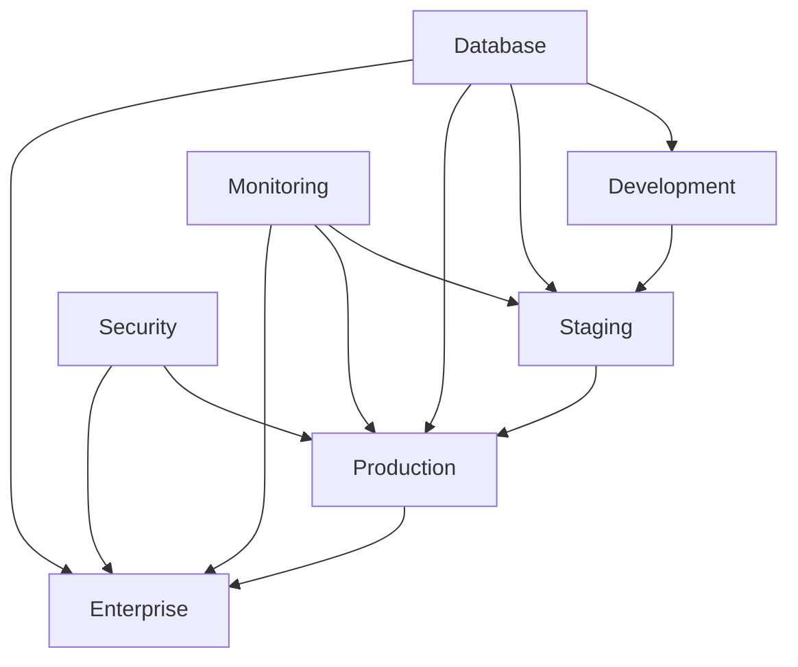

# 🔗 Critical Dependencies - Claude Code Observatory

## 📋 **Dependencies Overview**

This document provides a comprehensive mapping of all critical dependencies for the Claude Code Observatory project, including technical, external service, team skill, infrastructure, and cross-team coordination requirements. Each dependency includes risk assessment, mitigation strategies, and monitoring procedures to ensure project success.

### **Dependency Classification Framework**

```typescript
interface DependencyRisk {
  probability: 'Low' | 'Medium' | 'High';
  impact: 'Low' | 'Medium' | 'High' | 'Critical';
  timeline: 'Immediate' | 'Short-term' | 'Long-term';
  mitigation: MitigationStrategy[];
  monitoring: MonitoringProcedure[];
}

interface DependencyCategory {
  technical: TechnicalDependency[];
  external: ExternalDependency[];
  team: TeamSkillDependency[];
  infrastructure: InfrastructureDependency[];
  crossTeam: CrossTeamDependency[];
}
```

---

## 🔧 **Technical Dependencies Mapping**

### **Core Technology Stack Dependencies**

#### **Runtime Environment Dependencies**

**T1: Bun Runtime Ecosystem**
- **Description**: Bun runtime for high-performance JavaScript/TypeScript execution
- **Critical Path Impact**: Foundation for all backend services
- **Risk Level**: Medium Probability | High Impact
- **Timeline Dependencies**: Required Week 1 for development environment setup

**Risk Assessment:**
- **Probability**: Medium - Bun is relatively new technology
- **Impact**: High - Core runtime affects entire backend architecture
- **Specific Risks**:
  - Compatibility issues with existing Node.js libraries
  - Performance inconsistencies across platforms
  - Limited ecosystem compared to Node.js
  - Potential breaking changes in Bun updates

**Mitigation Strategies:**
1. **Fallback Plan**: Maintain Node.js compatibility layers
2. **Library Validation**: Test all critical libraries with Bun before integration
3. **Version Pinning**: Lock Bun version with controlled upgrade process
4. **Performance Benchmarking**: Continuous performance monitoring

**Monitoring Procedures:**
- Weekly compatibility testing with latest Bun releases
- Performance regression testing in CI/CD pipeline
- Community engagement for early warning of issues
- Backup Node.js environment maintained

---

**T2: TypeScript Compilation & Type Safety**
- **Description**: TypeScript for type-safe development across all packages
- **Critical Path Impact**: Development velocity and code quality
- **Risk Level**: Low Probability | Medium Impact
- **Timeline Dependencies**: Required Week 1 for project setup

**Risk Assessment:**
- **Probability**: Low - Mature, stable technology
- **Impact**: Medium - Affects development speed and bug detection
- **Specific Risks**:
  - Complex type definitions for file parsing
  - Performance impact of strict type checking
  - Integration complexity with dynamic libraries

**Mitigation Strategies:**
1. **Incremental Adoption**: Gradually increase strictness levels
2. **Type Libraries**: Maintain comprehensive type definitions
3. **Build Optimization**: Optimize TypeScript compilation for CI/CD
4. **Developer Training**: Ensure team TypeScript proficiency

**Monitoring Procedures:**
- Weekly build time analysis
- Type coverage reporting
- Developer productivity metrics
- Code quality trend analysis

---

#### **Data Layer Dependencies**

**T3: SQLite Database & WAL Mode**
- **Description**: SQLite with Write-Ahead Logging for local-first data storage
- **Critical Path Impact**: Data persistence and query performance
- **Risk Level**: Medium Probability | High Impact
- **Timeline Dependencies**: Required Week 2 for database foundation

**Risk Assessment:**
- **Probability**: Medium - Performance scaling concerns
- **Impact**: High - Core data persistence layer
- **Specific Risks**:
  - Performance degradation with large conversation volumes
  - Concurrent access limitations
  - File system performance variations
  - Data corruption risks during high-frequency writes

**Mitigation Strategies:**
1. **Database Sharding**: Implement partitioning strategy for scale
2. **Connection Pooling**: Optimize database connection management
3. **Backup Strategy**: Automated backup and recovery procedures
4. **Performance Monitoring**: Real-time database performance tracking

**Monitoring Procedures:**
- Daily database performance metrics
- Weekly backup verification tests
- Monthly data integrity checks
- Continuous query performance analysis

---

**T4: File System Monitoring (Chokidar)**
- **Description**: Cross-platform file system watching for conversation detection
- **Critical Path Impact**: Core value proposition - conversation capture
- **Risk Level**: High Probability | Critical Impact
- **Timeline Dependencies**: Required Week 3 for file monitoring system

**Risk Assessment:**
- **Probability**: High - File system operations are platform-dependent
- **Impact**: Critical - Core functionality depends on reliable file watching
- **Specific Risks**:
  - Platform-specific file system limitations
  - Performance degradation with large file counts
  - Permission issues in enterprise environments
  - File watching reliability during system load

**Mitigation Strategies:**
1. **Multi-Platform Testing**: Comprehensive testing on all target platforms
2. **Fallback Mechanisms**: Polling-based backup for critical scenarios
3. **Performance Optimization**: Efficient file handling and batching
4. **Error Recovery**: Graceful handling of file system errors

**Monitoring Procedures:**
- Real-time file detection latency monitoring
- Platform-specific performance testing
- Error rate tracking and alerting
- Weekly cross-platform compatibility testing

---

### **Frontend Technology Dependencies**

**T5: Vue 3 Ecosystem Integration**
- **Description**: Vue 3 Composition API, Pinia, Vue Router for frontend development
- **Critical Path Impact**: User interface and real-time updates
- **Risk Level**: Low Probability | Medium Impact
- **Timeline Dependencies**: Required Week 5 for dashboard development

**Risk Assessment:**
- **Probability**: Low - Mature ecosystem with active support
- **Impact**: Medium - Frontend user experience
- **Specific Risks**:
  - Component library compatibility issues
  - State management complexity at scale
  - Real-time update performance

**Mitigation Strategies:**
1. **Component Standardization**: Develop consistent component library
2. **State Architecture**: Well-defined state management patterns
3. **Performance Optimization**: Lazy loading and virtual scrolling
4. **Testing Strategy**: Comprehensive component testing

**Monitoring Procedures:**
- Weekly performance benchmarking
- Component reusability metrics
- User experience feedback collection
- Accessibility compliance testing

---

**T6: Real-Time Communication (WebSockets)**
- **Description**: WebSocket connections for live conversation updates
- **Critical Path Impact**: Real-time user experience
- **Risk Level**: Medium Probability | High Impact
- **Timeline Dependencies**: Required Week 6 for real-time features

**Risk Assessment:**
- **Probability**: Medium - Network reliability and scaling challenges
- **Impact**: High - Core real-time functionality
- **Specific Risks**:
  - Connection stability across different networks
  - Scaling challenges with many concurrent connections
  - Message delivery reliability
  - Browser compatibility variations

**Mitigation Strategies:**
1. **Connection Management**: Robust reconnection and heartbeat mechanisms
2. **Message Queuing**: Reliable message delivery with acknowledgments
3. **Load Balancing**: WebSocket connection distribution
4. **Fallback Options**: HTTP polling for unreliable connections

**Monitoring Procedures:**
- Real-time connection stability monitoring
- Message delivery success rate tracking
- Connection latency measurement
- Concurrent connection load testing

---

## 🌐 **External Service Dependencies**

### **AI and Analysis Services**

**E1: Claude API Integration**
- **Description**: Anthropic Claude API for conversation analysis and insights
- **Critical Path Impact**: Advanced analytics and AI features
- **Risk Level**: Medium Probability | High Impact
- **Timeline Dependencies**: Required Week 11 for AI-powered insights

**Risk Assessment:**
- **Probability**: Medium - External service reliability and rate limits
- **Impact**: High - Core differentiation feature
- **Specific Risks**:
  - API rate limiting affecting user experience
  - Service availability and downtime
  - Cost escalation with user growth
  - API changes breaking integration

**Mitigation Strategies:**
1. **Rate Limit Management**: Intelligent request batching and caching
2. **Fallback Analytics**: Rule-based analysis when API unavailable
3. **Cost Optimization**: Efficient prompt engineering and caching
4. **API Monitoring**: Real-time service health monitoring

**Dependencies Chain:**
- Claude API → Conversation Analysis → User Insights → Product Value
- Backup: Local rule-based analysis → Basic insights → Reduced value

**Monitoring Procedures:**
- Real-time API response time monitoring
- Daily cost and usage analysis
- Weekly service reliability reports
- Monthly API roadmap review with Anthropic

---

### **Infrastructure and Deployment Services**

**E2: GitHub Actions CI/CD**
- **Description**: GitHub Actions for automated testing, building, and deployment
- **Critical Path Impact**: Development velocity and deployment reliability
- **Risk Level**: Low Probability | Medium Impact
- **Timeline Dependencies**: Required Week 1 for CI/CD setup

**Risk Assessment:**
- **Probability**: Low - Mature, reliable service
- **Impact**: Medium - Development and deployment efficiency
- **Specific Risks**:
  - GitHub service outages affecting deployments
  - Action marketplace dependency changes
  - Resource quota limitations

**Mitigation Strategies:**
1. **Alternative CI/CD**: Backup deployment processes
2. **Action Pinning**: Version control for all GitHub Actions
3. **Local Development**: Maintain local build and test capabilities
4. **Multi-Provider Strategy**: Consider GitLab CI backup

**Monitoring Procedures:**
- Daily CI/CD pipeline success rate monitoring
- Weekly performance benchmark analysis
- Monthly action dependency review
- GitHub status page monitoring

---

**E3: Cloud Infrastructure Providers**
- **Description**: AWS, Azure, GCP for production deployment and scaling
- **Critical Path Impact**: Production deployment and enterprise scalability
- **Risk Level**: Low Probability | High Impact
- **Timeline Dependencies**: Required Week 21 for cloud deployment

**Risk Assessment:**
- **Probability**: Low - Multi-provider strategy reduces risk
- **Impact**: High - Production availability and performance
- **Specific Risks**:
  - Regional service outages
  - Pricing changes affecting margins
  - Compliance and security requirements
  - Vendor lock-in risks

**Mitigation Strategies:**
1. **Multi-Cloud Architecture**: Deploy across multiple providers
2. **Infrastructure as Code**: Portable deployment configurations
3. **Cost Monitoring**: Real-time cost tracking and alerts
4. **Disaster Recovery**: Cross-region backup and recovery

**Monitoring Procedures:**
- Real-time infrastructure health monitoring
- Daily cost analysis and optimization
- Weekly security compliance checks
- Monthly disaster recovery testing

---

## 👥 **Team Skill Dependencies**

### **Core Technical Competencies**

**S1: Advanced TypeScript & Modern JavaScript**
- **Description**: Deep TypeScript knowledge for complex type systems and performance optimization
- **Critical Path Impact**: Code quality, maintainability, and development velocity
- **Risk Level**: Medium Probability | High Impact
- **Timeline Dependencies**: Required immediately for all development phases

**Current Team Assessment:**
- **Tech Lead**: Expert level (95% proficiency)
- **Backend Developer**: Advanced level (85% proficiency)
- **Frontend Developer**: Intermediate level (75% proficiency)
- **Gap Analysis**: Frontend developer needs advanced TypeScript training

**Skill Requirements by Phase:**
- **Phase 1**: Basic TypeScript proficiency for all developers
- **Phase 2**: Advanced type system knowledge for analytics
- **Phase 3**: Expert-level optimization for enterprise performance

**Mitigation Strategies:**
1. **Training Program**: Structured TypeScript advancement curriculum
2. **Pair Programming**: Knowledge transfer sessions
3. **Code Review Process**: TypeScript best practices enforcement
4. **External Consulting**: Specialist consultation for complex scenarios

**Development Plan:**
- Week 1-2: TypeScript fundamentals training for frontend developer
- Week 3-4: Advanced patterns and performance optimization
- Ongoing: Code review feedback and best practices sharing

---

**S2: Real-Time System Architecture**
- **Description**: WebSocket implementation, event-driven architecture, and real-time data synchronization
- **Critical Path Impact**: Core real-time functionality and user experience
- **Risk Level**: High Probability | Critical Impact
- **Timeline Dependencies**: Required Week 6 for real-time features

**Current Team Assessment:**
- **Tech Lead**: Advanced level (80% proficiency)
- **Backend Developer**: Intermediate level (70% proficiency)
- **Frontend Developer**: Basic level (60% proficiency)
- **Gap Analysis**: Team needs hands-on real-time system experience

**Specific Skill Requirements:**
- WebSocket connection management and scaling
- Event-driven architecture patterns
- State synchronization across clients
- Performance optimization for real-time systems

**Mitigation Strategies:**
1. **Architecture Workshops**: Real-time system design sessions
2. **Prototype Development**: Early proof-of-concept implementation
3. **External Review**: Architecture review by real-time systems expert
4. **Incremental Implementation**: Phased rollout of real-time features

**Development Plan:**
- Week 4-5: Real-time architecture training and prototyping
- Week 6: Implementation with expert guidance
- Week 7-8: Performance optimization and testing

---

**S3: Enterprise Security & Compliance**
- **Description**: Security architecture, compliance frameworks, and enterprise authentication
- **Critical Path Impact**: Enterprise customer acquisition and regulatory compliance
- **Risk Level**: High Probability | Critical Impact
- **Timeline Dependencies**: Required Week 17 for enterprise features

**Current Team Assessment:**
- **Security Specialist**: Expert level (90% proficiency)
- **Tech Lead**: Intermediate level (70% proficiency)
- **Other Team Members**: Basic level (50% proficiency)
- **Gap Analysis**: Team needs comprehensive security training

**Specific Skill Requirements:**
- SOC 2, GDPR, HIPAA compliance implementation
- Enterprise authentication (SAML, OAuth, Active Directory)
- Security audit preparation and response
- Threat modeling and vulnerability assessment

**Mitigation Strategies:**
1. **Security Training Program**: Comprehensive security education
2. **Compliance Consultant**: Expert guidance for regulatory requirements
3. **Security Review Process**: Regular security audits and assessments
4. **Documentation Standards**: Comprehensive security documentation

**Development Plan:**
- Week 15-16: Security and compliance training
- Week 17: Implementation with security specialist leadership
- Week 18: Security audit and compliance verification

---

### **Product and Business Skills**

**S4: AI/ML Integration & Optimization**
- **Description**: AI API integration, prompt engineering, and machine learning concepts
- **Critical Path Impact**: Advanced analytics and competitive differentiation
- **Risk Level**: Medium Probability | High Impact
- **Timeline Dependencies**: Required Week 11 for AI features

**Current Team Assessment:**
- **Tech Lead**: Intermediate level (70% proficiency)
- **Backend Developer**: Basic level (60% proficiency)
- **Team Gap**: No dedicated AI/ML expertise

**Mitigation Strategies:**
1. **AI Integration Training**: Claude API and prompt engineering
2. **ML Consultant**: Part-time AI/ML expert for complex features
3. **Community Engagement**: Active participation in AI development communities
4. **Iterative Learning**: Start with simple integrations and build complexity

**Development Plan:**
- Week 9-10: AI integration training and experimentation
- Week 11-12: Implementation with consultant support
- Ongoing: Continuous learning and optimization

---

## 🏗️ **Infrastructure Requirements**

### **Development Infrastructure**

**I1: Development Environment Standardization**
- **Description**: Consistent development environments across team members
- **Critical Path Impact**: Development velocity and collaboration efficiency
- **Risk Level**: Medium Probability | Medium Impact
- **Timeline Dependencies**: Required Week 1 for team productivity

**Requirements:**
- Docker-based development environment
- Consistent Node.js/Bun versions across platforms
- Shared development database and test data
- Standardized IDE configurations and extensions

**Risk Assessment:**
- **Platform Differences**: Windows/macOS/Linux compatibility issues
- **Version Drift**: Inconsistent tool versions across team
- **Performance Variations**: Development environment performance differences

**Mitigation Strategies:**
1. **Containerized Development**: Docker-based environment standardization
2. **Version Management**: Explicit version pinning for all tools
3. **Documentation**: Comprehensive setup and troubleshooting guides
4. **Automation**: Scripted environment setup and validation

**Implementation Plan:**
- Week 1: Development environment setup and documentation
- Ongoing: Regular environment updates and maintenance
- Weekly: Environment consistency validation

---

**I2: CI/CD Pipeline Infrastructure**
- **Description**: Automated testing, building, and deployment infrastructure
- **Critical Path Impact**: Code quality, deployment reliability, and development velocity
- **Risk Level**: Low Probability | High Impact
- **Timeline Dependencies**: Required Week 1 for development workflow

**Infrastructure Components:**
- GitHub Actions for CI/CD automation
- Automated testing across multiple environments
- Security scanning and dependency checking
- Deployment automation for multiple environments

**Risk Assessment:**
- **Pipeline Reliability**: CI/CD failures blocking development
- **Performance**: Long pipeline execution times
- **Security**: Vulnerabilities in dependencies or infrastructure

**Mitigation Strategies:**
1. **Pipeline Optimization**: Parallel execution and caching
2. **Backup Systems**: Alternative CI/CD options available
3. **Security Integration**: Automated security scanning
4. **Performance Monitoring**: Pipeline execution time tracking

---

### **Production Infrastructure**

**I3: Multi-Environment Deployment Architecture**
- **Description**: Development, staging, and production environment infrastructure
- **Critical Path Impact**: Testing reliability and production deployment
- **Risk Level**: Medium Probability | High Impact
- **Timeline Dependencies**: Required Week 8 for MVP deployment

**Environment Requirements:**
- **Development**: Local and shared development environments
- **Staging**: Production-like environment for testing
- **Production**: Scalable, secure production infrastructure
- **Enterprise**: On-premises and hybrid deployment options

**Infrastructure Dependencies:**


**Mitigation Strategies:**
1. **Infrastructure as Code**: Version-controlled infrastructure definitions
2. **Environment Parity**: Consistent configuration across environments
3. **Automated Deployment**: Reliable deployment automation
4. **Disaster Recovery**: Backup and recovery procedures

---

**I4: Monitoring and Observability Infrastructure**
- **Description**: Comprehensive monitoring, logging, and alerting systems
- **Critical Path Impact**: Production reliability and issue resolution
- **Risk Level**: Medium Probability | High Impact
- **Timeline Dependencies**: Required Week 16 for production readiness

**Monitoring Requirements:**
- Application performance monitoring
- Infrastructure health monitoring
- Security event monitoring
- Business metrics tracking
- User experience monitoring

**Dependencies:**
- Monitoring service providers (DataDog, New Relic alternatives)
- Log aggregation and analysis systems
- Alerting and incident response systems
- Dashboard and visualization tools

**Mitigation Strategies:**
1. **Multi-Provider Strategy**: Avoid single point of failure
2. **Self-Hosted Options**: Backup monitoring capabilities
3. **Alerting Optimization**: Minimize false positives
4. **Incident Response**: Automated escalation procedures

---

## 🤝 **Cross-Team Coordination Dependencies**

### **Internal Team Coordination**

**C1: Development Team Synchronization**
- **Description**: Coordination between frontend, backend, and infrastructure development
- **Critical Path Impact**: Integration success and development velocity
- **Risk Level**: Medium Probability | High Impact
- **Timeline Dependencies**: Ongoing throughout all phases

**Coordination Requirements:**
- API contract definition and maintenance
- Database schema change management
- Feature integration and testing
- Release coordination and deployment

**Risk Assessment:**
- **Communication Gaps**: Misaligned development efforts
- **Integration Issues**: Components not working together
- **Timeline Conflicts**: Blocking dependencies between teams

**Mitigation Strategies:**
1. **Daily Standups**: Regular communication and coordination
2. **API-First Development**: Contract-driven development approach
3. **Integration Testing**: Continuous integration validation
4. **Documentation**: Comprehensive interface documentation

**Coordination Framework:**
```typescript
interface TeamCoordination {
  communication: {
    dailyStandups: boolean;
    weeklyPlanning: boolean;
    monthlyRetrospectives: boolean;
  };
  
  technical: {
    apiContracts: APIContract[];
    databaseMigrations: Migration[];
    integrationTests: IntegrationTest[];
  };
  
  planning: {
    sprintPlanning: boolean;
    crossTeamDependencies: Dependency[];
    riskAssessment: Risk[];
  };
}
```

---

### **External Stakeholder Dependencies**

**C2: Enterprise Customer Validation**
- **Description**: Coordination with enterprise customers for feature validation and feedback
- **Critical Path Impact**: Product-market fit and enterprise feature requirements
- **Risk Level**: High Probability | Critical Impact
- **Timeline Dependencies**: Required Week 16 for enterprise feature validation

**Stakeholder Coordination:**
- Enterprise customer advisory board
- Security and compliance requirement gathering
- Integration requirement validation
- Pilot deployment coordination

**Risk Assessment:**
- **Customer Availability**: Limited access to enterprise stakeholders
- **Requirement Changes**: Evolving enterprise requirements
- **Timeline Pressure**: Customer timeline constraints

**Mitigation Strategies:**
1. **Advisory Board**: Structured customer engagement program
2. **Early Engagement**: Customer involvement from Phase 2
3. **Flexible Architecture**: Adaptable to changing requirements
4. **Multiple Customers**: Diverse customer validation

---

**C3: Community and Open Source Coordination**
- **Description**: Coordination with open source community and developer ecosystem
- **Critical Path Impact**: Community adoption and ecosystem development
- **Risk Level**: Medium Probability | Medium Impact
- **Timeline Dependencies**: Required Week 23 for community launch

**Community Dependencies:**
- Open source contribution guidelines
- Community feedback integration
- Developer relations and advocacy
- Documentation and onboarding

**Mitigation Strategies:**
1. **Community Program**: Structured community engagement
2. **Documentation Excellence**: Comprehensive developer resources
3. **Feedback Systems**: Multiple channels for community input
4. **Recognition Programs**: Community contributor recognition

---

## 📊 **Dependency Risk Assessment Matrix**

### **Risk Probability vs Impact Analysis**

| Dependency | Probability | Impact | Risk Score | Mitigation Priority |
|------------|------------|---------|------------|-------------------|
| File System Monitoring (T4) | High | Critical | 9 | Immediate |
| Enterprise Security Skills (S3) | High | Critical | 9 | Immediate |
| Real-Time Architecture Skills (S2) | High | Critical | 8 | High |
| Enterprise Customer Validation (C2) | High | Critical | 8 | High |
| Claude API Integration (E1) | Medium | High | 6 | Medium |
| SQLite Database Performance (T3) | Medium | High | 6 | Medium |
| WebSocket Implementation (T6) | Medium | High | 6 | Medium |
| Bun Runtime Stability (T1) | Medium | High | 6 | Medium |
| Development Team Coordination (C1) | Medium | High | 6 | Medium |
| Infrastructure Monitoring (I4) | Medium | High | 6 | Medium |

### **Dependency Timeline Mapping**

```mermaid
gantt
    title Critical Dependencies Timeline
    dateFormat  X
    axisFormat %s
    
    section Week 1-8 Phase 1
    Bun Runtime (T1)           :milestone, 1, 0d
    TypeScript Setup (T2)      :milestone, 1, 0d
    CI/CD Pipeline (E2)        :milestone, 1, 0d
    Dev Environment (I1)       :milestone, 1, 0d
    Database Foundation (T3)   :milestone, 2, 0d
    File Monitoring (T4)       :crit, 3, 2d
    Real-Time Skills (S2)      :crit, 4, 4d
    WebSocket Impl (T6)        :6, 2d
    
    section Week 9-16 Phase 2
    Claude API (E1)            :11, 2d
    AI Skills (S4)             :9, 4d
    Performance Monitor (I4)   :16, 1d
    
    section Week 17-24 Phase 3
    Security Skills (S3)       :crit, 17, 2d
    Cloud Infrastructure (E3)  :21, 2d
    Enterprise Validation (C2) :crit, 16, 8d
    Community Coordination (C3):23, 2d
```



---

## 🛡️ **Risk Mitigation Strategies**

### **High-Priority Risk Mitigation**

#### **File System Monitoring Reliability**
**Timeline**: Week 3-4 (Critical Path)

**Comprehensive Mitigation Approach:**
1. **Multi-Platform Testing Framework**
   - Automated testing on Windows, macOS, Linux
   - Virtual machine testing for various OS versions
   - Performance benchmarking across file systems

2. **Fallback Mechanisms**
   - Polling-based backup monitoring
   - Manual conversation import capabilities
   - API-based monitoring for enterprise environments

3. **Performance Optimization**
   - Efficient file handle management
   - Incremental reading strategies
   - Background processing queues

4. **Error Recovery Systems**
   - Graceful degradation on file access failures
   - Automatic retry mechanisms
   - User notification and manual recovery options

**Success Criteria:**
- 95%+ conversation detection rate across all platforms
- <100ms average detection latency
- Graceful handling of 99% of file system error scenarios

---

#### **Enterprise Security & Compliance**
**Timeline**: Week 17-18 (Critical Path)

**Comprehensive Mitigation Approach:**
1. **Expert Consultation Program**
   - Security architect consultation
   - Compliance specialist guidance
   - Regular security review sessions

2. **Training and Certification**
   - Team security certification programs
   - Hands-on compliance implementation training
   - Security best practices workshops

3. **Implementation Strategy**
   - Incremental security feature rollout
   - Continuous security testing
   - Regular penetration testing

4. **Documentation and Processes**
   - Comprehensive security documentation
   - Incident response procedures
   - Compliance audit preparation

**Success Criteria:**
- Pass professional security audit
- Meet SOC 2 Type II requirements
- Enterprise customer security approval

---

### **Medium-Priority Risk Mitigation**

#### **Claude API Integration Reliability**
**Timeline**: Week 11-12

**Mitigation Strategies:**
1. **API Resilience Framework**
   - Request retry mechanisms with exponential backoff
   - Circuit breaker patterns for API failures
   - Rate limiting with intelligent queuing

2. **Cost Management System**
   - Real-time cost monitoring and alerts
   - Efficient prompt optimization
   - Caching strategies for repeated analysis

3. **Fallback Analytics Engine**
   - Rule-based conversation analysis
   - Pattern recognition algorithms
   - User-configurable analysis preferences

4. **Multi-Provider Strategy**
   - Integration preparation for alternative AI APIs
   - Provider switching capabilities
   - Performance comparison frameworks

---

#### **Real-Time System Performance**
**Timeline**: Week 6

**Mitigation Strategies:**
1. **Architecture Best Practices**
   - Scalable WebSocket architecture
   - Efficient message broadcasting
   - Connection pooling and management

2. **Performance Optimization**
   - Message batching and compression
   - Client-side caching strategies
   - Load balancing across connections

3. **Monitoring and Alerting**
   - Real-time performance monitoring
   - Connection health tracking
   - Automated scaling triggers

---

## 📈 **Dependency Monitoring Procedures**

### **Continuous Monitoring Framework**

#### **Technical Dependency Monitoring**

**Daily Monitoring:**
- File system monitoring performance metrics
- Database query performance analysis
- WebSocket connection stability tracking
- CI/CD pipeline success rates

**Weekly Monitoring:**
- Cross-platform compatibility testing
- Security vulnerability scanning
- Performance regression analysis
- Dependency update assessment

**Monthly Monitoring:**
- Full system integration testing
- Disaster recovery procedure validation
- Security compliance review
- Technology roadmap alignment

#### **External Service Monitoring**

**Real-Time Monitoring:**
- Claude API response times and success rates
- Cloud infrastructure health and performance
- GitHub Actions pipeline status
- External service dependency status

**Daily Analysis:**
- Cost tracking and optimization opportunities
- Service level agreement compliance
- Error rate analysis and trending
- Capacity utilization assessment

#### **Team and Skill Monitoring**

**Weekly Assessment:**
- Team skill development progress
- Training program completion rates
- Code review quality metrics
- Knowledge sharing effectiveness

**Monthly Evaluation:**
- Skill gap analysis updates
- Training program effectiveness review
- Team velocity and productivity assessment
- Knowledge transfer success measurement

---

## 🎯 **Success Criteria and Validation**

### **Dependency Resolution Validation**

#### **Phase 1 Validation (Week 8)**
- [ ] All technical dependencies operational with <5% failure rate
- [ ] Team skills sufficient for Phase 2 requirements
- [ ] Infrastructure supporting MVP deployment
- [ ] External services integrated and stable

#### **Phase 2 Validation (Week 16)**
- [ ] Advanced features dependencies resolved
- [ ] Enterprise customer validation completed
- [ ] Performance optimization dependencies managed
- [ ] AI integration delivering expected value

#### **Phase 3 Validation (Week 24)**
- [ ] All enterprise dependencies resolved
- [ ] Community coordination framework operational
- [ ] Production infrastructure fully validated
- [ ] Launch readiness criteria met

### **Dependency Health Metrics**

```typescript
interface DependencyHealth {
  technical: {
    systemReliability: number;      // % uptime
    performanceCompliance: number;  // % within SLA
    securityPosture: number;       // Security score
  };
  
  external: {
    serviceAvailability: number;    // % service uptime
    apiPerformance: number;        // Average response time
    costOptimization: number;      // Cost efficiency score
  };
  
  team: {
    skillReadiness: number;        // % required skills available
    velocityTrend: number;         // Development velocity trend
    knowledgeDistribution: number; // Knowledge sharing score
  };
  
  coordination: {
    communicationEffectiveness: number; // Communication score
    integrationSuccess: number;         // Integration success rate
    stakeholderSatisfaction: number;    // Stakeholder feedback score
  };
}
```

---

## 📋 **Dependency Management Action Plan**

### **Immediate Actions (Week 1-2)**
1. **Technical Foundation Setup**
   - Establish Bun runtime environment
   - Configure TypeScript across all packages
   - Set up SQLite database with WAL mode
   - Implement CI/CD pipeline with security scanning

2. **Team Skill Assessment**
   - Complete comprehensive skill gap analysis
   - Design training programs for identified gaps
   - Establish mentoring and knowledge transfer processes
   - Set up regular skill development tracking

3. **Infrastructure Preparation**
   - Standardize development environments
   - Establish monitoring and alerting systems
   - Configure multi-environment deployment pipeline
   - Implement security and compliance frameworks

### **Short-Term Actions (Week 3-8)**
1. **Critical Path Dependencies**
   - Implement and validate file system monitoring
   - Develop real-time communication infrastructure
   - Complete team training for critical skills
   - Establish external service integrations

2. **Risk Mitigation Implementation**
   - Deploy backup and fallback systems
   - Validate cross-platform compatibility
   - Establish performance monitoring
   - Complete security framework implementation

### **Long-Term Actions (Week 9-24)**
1. **Advanced Dependencies**
   - Integrate AI/ML services and optimization
   - Complete enterprise security and compliance
   - Establish community coordination frameworks
   - Finalize production infrastructure

2. **Continuous Improvement**
   - Ongoing dependency health monitoring
   - Regular risk assessment updates
   - Team skill advancement programs
   - Stakeholder feedback integration

---

*This critical dependencies document provides comprehensive mapping and mitigation strategies for all project dependencies, ensuring successful delivery of Claude Code Observatory within the 24-week timeline while maintaining high quality and reliability standards.*