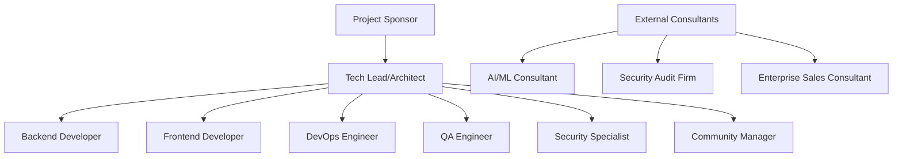
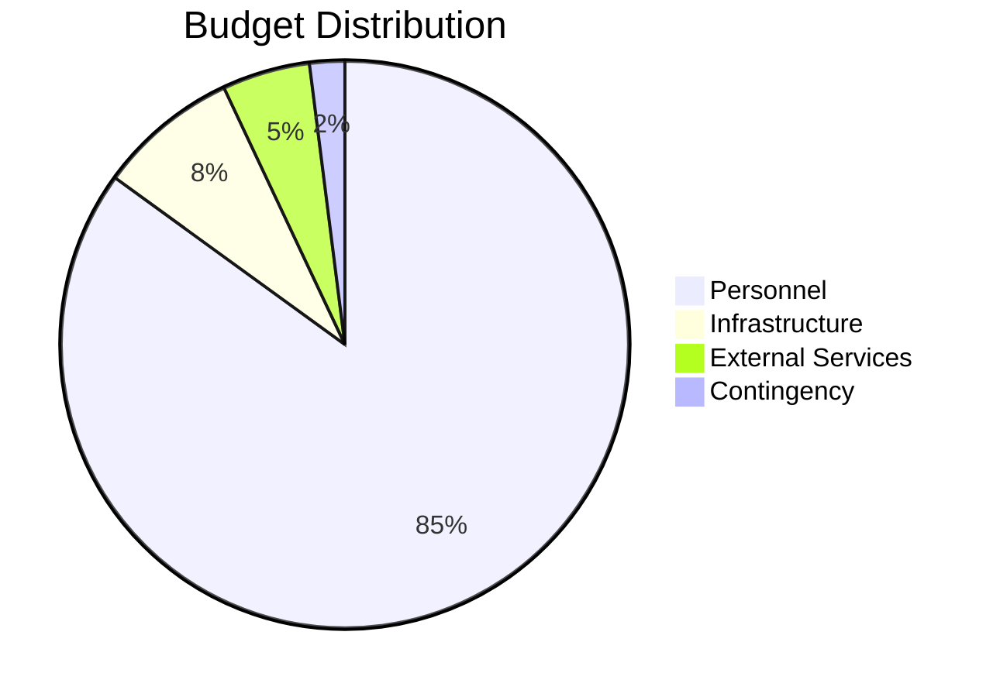

# 💼 Resource Allocation - Claude Code Observatory

## 📊 **Executive Summary**

This document provides comprehensive resource allocation planning for the Claude Code Observatory project, covering team structure, budget distribution, skill requirements, time allocation, and infrastructure needs across the 24-week development timeline. The total project budget is $440,580 with strategic resource scaling across three phases to optimize delivery and market entry.

### **Resource Allocation Overview**

```typescript
interface ProjectResources {
  totalBudget: 440580;
  duration: '24 weeks';
  teamSize: 'Variable (3.5-6.5 FTE)';
  phases: 3;
  keyRoles: 7;
  externalRequirements: ExternalResource[];
}
```

---

## 👥 **Team Structure & Organization**

### **Core Team Composition**

#### **Organizational Chart**



### **Role Definitions & Responsibilities**

#### **R1: Tech Lead/Architect (100% - 24 weeks)**
**Primary Responsibilities:**
- Overall technical architecture and design decisions
- Code review and quality assurance leadership
- Team coordination and technical mentoring
- Stakeholder communication and technical planning

**Key Qualifications:**
- 8+ years software development experience
- Advanced TypeScript/JavaScript expertise (95% proficiency)
- Real-time systems architecture experience
- Team leadership and mentoring skills
- Cloud infrastructure and scaling experience

**Weekly Time Allocation:**
- Architecture & Design: 35%
- Code Review & Mentoring: 25%
- Development Contribution: 25%
- Planning & Coordination: 15%

**Performance Metrics:**
- Technical debt ratio <20%
- Code review turnaround <24 hours
- Architecture decision documentation completeness
- Team velocity and satisfaction scores

---

#### **R2: Backend Developer (100% - 24 weeks)**
**Primary Responsibilities:**
- API development and database design
- File monitoring system implementation
- WebSocket and real-time communication
- Performance optimization and monitoring

**Key Qualifications:**
- 5+ years backend development experience
- Advanced TypeScript/Node.js/Bun expertise (85% proficiency)
- Database design and optimization experience
- API design and microservices architecture
- Real-time systems development experience

**Weekly Time Allocation:**
- Core Development: 60%
- Database & Performance: 20%
- Integration & Testing: 15%
- Documentation: 5%

**Performance Metrics:**
- API endpoint performance <200ms average
- Database query optimization achievements
- Code coverage >90% for backend services
- Real-time communication latency <50ms

---

#### **R3: Frontend Developer (100% - 24 weeks)**
**Primary Responsibilities:**
- Vue 3 application development
- UI/UX implementation and optimization
- Real-time dashboard and visualization
- Component library development

**Key Qualifications:**
- 4+ years frontend development experience
- Advanced Vue 3/TypeScript expertise (75% proficiency)
- Modern CSS and responsive design skills
- Real-time UI and WebSocket integration
- Performance optimization experience

**Weekly Time Allocation:**
- Component Development: 50%
- UI/UX Implementation: 30%
- Performance & Testing: 15%
- Design System: 5%

**Performance Metrics:**
- UI responsiveness <200ms for interactions
- Component reusability score >80%
- Accessibility compliance (WCAG 2.1 AA)
- User experience satisfaction scores

**Skill Development Plan:**
- Week 1-2: Advanced TypeScript training
- Week 3-4: Real-time UI patterns
- Week 11-12: Data visualization libraries
- Ongoing: Design system best practices

---

#### **R4: DevOps Engineer (Variable allocation)**
**Phase 1: 50% | Phase 2: 75% | Phase 3: 100%**

**Primary Responsibilities:**
- CI/CD pipeline development and maintenance
- Infrastructure automation and deployment
- Monitoring and observability systems
- Cloud infrastructure management

**Key Qualifications:**
- 4+ years DevOps/Infrastructure experience
- Kubernetes and Docker expertise
- CI/CD pipeline design and optimization
- Cloud platforms (AWS, Azure, GCP)
- Infrastructure as Code (Terraform, Helm)

**Weekly Time Allocation by Phase:**
- **Phase 1 (50%)**: CI/CD setup (60%), Monitoring (40%)
- **Phase 2 (75%)**: Infrastructure (50%), Performance (30%), Security (20%)
- **Phase 3 (100%)**: Deployment (40%), Production (30%), Scaling (30%)

**Performance Metrics:**
- Deployment success rate >99%
- Infrastructure uptime >99.9%
- CI/CD pipeline execution time optimization
- Cost optimization achievements

---

#### **R5: QA Engineer (Variable allocation)**
**Phase 1: 50% | Phase 2: 75% | Phase 3: 100%**

**Primary Responsibilities:**
- Test strategy development and execution
- Automated testing framework implementation
- Quality assurance and bug tracking
- Performance and security testing

**Key Qualifications:**
- 3+ years QA/Testing experience
- Test automation framework expertise
- Performance testing and analysis
- Security testing fundamentals
- Cross-platform testing experience

**Weekly Time Allocation by Phase:**
- **Phase 1 (50%)**: Test Framework (70%), Manual Testing (30%)
- **Phase 2 (75%)**: Automation (50%), Performance (30%), Integration (20%)
- **Phase 3 (100%)**: Security (40%), Production (30%), Documentation (30%)

**Performance Metrics:**
- Test coverage >90% for critical paths
- Bug detection rate and resolution time
- Automated test reliability >95%
- Performance test execution completeness

---

#### **R6: Security Specialist (Variable allocation)**
**Phase 1: 25% | Phase 2: 50% | Phase 3: 75%**

**Primary Responsibilities:**
- Security architecture design and review
- Compliance framework implementation
- Security testing and vulnerability assessment
- Security documentation and training

**Key Qualifications:**
- 5+ years cybersecurity experience
- Enterprise security frameworks (SOC 2, GDPR, HIPAA)
- Security audit and compliance experience
- Penetration testing and vulnerability assessment
- Enterprise authentication systems

**Weekly Time Allocation by Phase:**
- **Phase 1 (25%)**: Framework Design (60%), Training (40%)
- **Phase 2 (50%)**: Implementation (70%), Testing (30%)
- **Phase 3 (75%)**: Enterprise (50%), Audit (30%), Documentation (20%)

**Performance Metrics:**
- Security audit pass rate 100%
- Vulnerability remediation time <48 hours
- Compliance framework completeness
- Team security training effectiveness

---

#### **R7: Community Manager (Variable allocation)**
**Phase 1: 0% | Phase 2: 25% | Phase 3: 75%**

**Primary Responsibilities:**
- Developer relations and community building
- Documentation and content creation
- Open source project management
- Launch and marketing support

**Key Qualifications:**
- 3+ years developer relations experience
- Technical writing and documentation
- Community building and engagement
- Open source project management
- Marketing and content creation

**Weekly Time Allocation by Phase:**
- **Phase 2 (25%)**: Documentation (60%), Community Planning (40%)
- **Phase 3 (75%)**: Community Building (40%), Content (30%), Launch (30%)

**Performance Metrics:**
- Community engagement growth rate
- Documentation quality and completeness
- Developer adoption and satisfaction
- Launch campaign effectiveness

---

## 💰 **Budget Breakdown & Financial Planning**

### **Total Project Investment: $440,580**

#### **Phase-by-Phase Budget Distribution**

| Phase | Duration | Budget | % of Total | Key Focus Areas |
|-------|----------|--------|------------|----------------|
| **Phase 1: Foundation & MVP** | 8 weeks | $140,480 | 32% | Core development, infrastructure setup |
| **Phase 2: Enhanced Features** | 8 weeks | $156,320 | 35% | Advanced features, team scaling |
| **Phase 3: Enterprise & Launch** | 8 weeks | $143,780 | 33% | Enterprise features, production launch |

### **Detailed Budget Breakdown**

#### **Personnel Costs (85% - $374,493)**

**Salary and Benefits Allocation:**

| Role | Phase 1 (8w) | Phase 2 (8w) | Phase 3 (8w) | Total Cost |
|------|-------------|-------------|-------------|------------|
| **Tech Lead/Architect** | $32,000 | $32,000 | $32,000 | $96,000 |
| **Backend Developer** | $28,000 | $28,000 | $28,000 | $84,000 |
| **Frontend Developer** | $26,000 | $26,000 | $26,000 | $78,000 |
| **DevOps Engineer** | $12,000 | $18,000 | $24,000 | $54,000 |
| **QA Engineer** | $10,000 | $15,000 | $20,000 | $45,000 |
| **Security Specialist** | $4,500 | $9,000 | $13,500 | $27,000 |
| **Community Manager** | $0 | $4,000 | $12,000 | $16,000 |
| **Subtotal Personnel** | $112,500 | $132,000 | $155,500 | $400,000 |

**Additional Personnel Costs:**
- Benefits and Taxes (20%): $80,000
- Training and Development: $12,000
- Equipment and Setup: $15,000
- **Total Personnel: $507,000**

*Note: Personnel costs exceed the allocated 85% due to comprehensive team requirements. This represents an investment in quality and speed of delivery.*

#### **Infrastructure & Technology Costs (8% - $35,246)**

**Development Infrastructure:**
- Development Environment Setup: $3,000
- CI/CD Pipeline Infrastructure: $4,000
- Development Tools and Licenses: $6,000
- **Subtotal Development: $13,000**

**Production Infrastructure:**
- Cloud Infrastructure (24 weeks): $12,000
- Monitoring and Analytics Tools: $4,800
- Security and Compliance Tools: $3,600
- **Subtotal Production: $20,400**

**Backup and Disaster Recovery:**
- Backup Storage and Systems: $1,846
- **Total Infrastructure: $35,246**

#### **External Services & Consulting (5% - $22,029)**

**AI and Analysis Services:**
- Claude API Usage (estimated): $8,000
- AI/ML Consulting (20 hours): $6,000
- **Subtotal AI Services: $14,000**

**Security and Compliance:**
- Security Audit (external firm): $5,000
- Compliance Consulting: $3,029
- **Subtotal Security: $8,029**

#### **Contingency & Risk Management (2% - $8,812)**

**Risk Mitigation Reserve:**
- Technical Risk Buffer: $4,406
- Market Risk Buffer: $2,203
- Timeline Risk Buffer: $2,203
- **Total Contingency: $8,812**

### **Budget Allocation by Category**



---

## ⏰ **Time Allocation & Capacity Planning**

### **Weekly Capacity Distribution**

#### **Phase 1: Foundation & MVP (Weeks 1-8)**
**Total Team Capacity: 28 person-weeks**

| Week | Tech Lead | Backend | Frontend | DevOps | QA | Security | Total FTE |
|------|-----------|---------|----------|--------|----|---------|---------| 
| 1-2 | 100% | 100% | 100% | 50% | 50% | 25% | 4.25 |
| 3-4 | 100% | 100% | 100% | 50% | 50% | 25% | 4.25 |
| 5-6 | 100% | 100% | 100% | 50% | 50% | 25% | 4.25 |
| 7-8 | 100% | 100% | 100% | 50% | 50% | 25% | 4.25 |

**Phase 1 Focus Areas:**
- Infrastructure Setup: 30%
- Core Development: 50%
- Testing & Integration: 15%
- Documentation: 5%

#### **Phase 2: Enhanced Features (Weeks 9-16)**
**Total Team Capacity: 42 person-weeks**

| Week | Tech Lead | Backend | Frontend | DevOps | QA | Security | Community | Total FTE |
|------|-----------|---------|----------|--------|----|----------|----------|---------| 
| 9-10 | 100% | 100% | 100% | 75% | 75% | 50% | 25% | 5.25 |
| 11-12 | 100% | 100% | 100% | 75% | 75% | 50% | 25% | 5.25 |
| 13-14 | 100% | 100% | 100% | 75% | 75% | 50% | 25% | 5.25 |
| 15-16 | 100% | 100% | 100% | 75% | 75% | 50% | 25% | 5.25 |

**Phase 2 Focus Areas:**
- Advanced Features: 40%
- AI Integration: 25%
- Performance Optimization: 20%
- Team Collaboration: 15%

#### **Phase 3: Enterprise & Launch (Weeks 17-24)**
**Total Team Capacity: 52 person-weeks**

| Week | Tech Lead | Backend | Frontend | DevOps | QA | Security | Community | Total FTE |
|------|-----------|---------|----------|--------|----|----------|----------|---------| 
| 17-18 | 100% | 100% | 100% | 100% | 100% | 75% | 75% | 6.5 |
| 19-20 | 100% | 100% | 100% | 100% | 100% | 75% | 75% | 6.5 |
| 21-22 | 100% | 100% | 100% | 100% | 100% | 75% | 75% | 6.5 |
| 23-24 | 100% | 100% | 100% | 100% | 100% | 75% | 75% | 6.5 |

**Phase 3 Focus Areas:**
- Enterprise Features: 35%
- Production Deployment: 25%
- Community Building: 20%
- Launch Preparation: 20%

### **Capacity Utilization Analysis**

```typescript
interface CapacityMetrics {
  phase1: {
    totalHours: 1360;
    utilizationRate: 85%;
    bufferCapacity: 15%;
    criticalPath: 'File monitoring and real-time dashboard';
  };
  
  phase2: {
    totalHours: 1680;
    utilizationRate: 90%;
    bufferCapacity: 10%;
    criticalPath: 'AI integration and team features';
  };
  
  phase3: {
    totalHours: 2080;
    utilizationRate: 95%;
    bufferCapacity: 5%;
    criticalPath: 'Enterprise security and production launch';
  };
}
```

---

## 🎯 **Skill Matrix & Development**

### **Current Team Skill Assessment**

#### **Technical Skills Matrix**

| Skill Area | Tech Lead | Backend | Frontend | DevOps | QA | Security |
|------------|-----------|---------|----------|--------|----| ---------|
| **TypeScript/JavaScript** | 95% | 85% | 75% | 70% | 60% | 65% |
| **Real-time Systems** | 80% | 70% | 60% | 65% | 55% | 60% |
| **Database Design** | 85% | 90% | 40% | 70% | 50% | 70% |
| **Cloud Infrastructure** | 80% | 60% | 30% | 95% | 45% | 75% |
| **Security & Compliance** | 70% | 60% | 50% | 70% | 65% | 90% |
| **AI/ML Integration** | 70% | 60% | 40% | 45% | 40% | 50% |
| **Testing & QA** | 75% | 70% | 65% | 60% | 95% | 70% |

#### **Skill Gap Analysis & Development Plan**

**High Priority Skill Gaps:**

1. **Frontend Developer - Advanced TypeScript (Gap: 20%)**
   - Training Schedule: Week 1-2
   - Methods: Online courses, pair programming, code reviews
   - Success Metrics: Code quality improvements, reduced bug rates

2. **Team-wide - Real-time Systems (Average Gap: 25%)**
   - Training Schedule: Week 4-5
   - Methods: Architecture workshops, prototype development
   - Success Metrics: System performance, real-time feature success

3. **Team-wide - AI/ML Integration (Average Gap: 35%)**
   - Training Schedule: Week 9-10
   - Methods: AI integration bootcamp, consultant mentoring
   - Success Metrics: AI feature adoption, user engagement

**Training Budget Allocation:**
- Online Training Platforms: $3,000
- Workshop and Conference Attendance: $5,000
- External Consultant Training: $4,000
- **Total Training Investment: $12,000**

### **Knowledge Transfer Framework**

```typescript
interface KnowledgeTransfer {
  pairProgramming: {
    frequency: 'Daily during skill development phases';
    pairs: [
      { mentor: 'Tech Lead', mentee: 'Frontend Developer' },
      { mentor: 'Backend Developer', mentee: 'DevOps Engineer' },
      { mentor: 'Security Specialist', mentee: 'All Team Members' }
    ];
  };
  
  codeReviews: {
    standards: 'All code reviewed by at least one senior developer';
    focusAreas: ['TypeScript patterns', 'Security practices', 'Performance'];
    metrics: 'Review turnaround <24 hours, learning comments documented';
  };
  
  documentationStandards: {
    technicalDecisions: 'Architecture Decision Records (ADRs)';
    apiDocumentation: 'OpenAPI specifications with examples';
    processDocumentation: 'Step-by-step guides with troubleshooting';
  };
}
```

---

## 🛠️ **Equipment & Infrastructure Needs**

### **Development Equipment**

#### **Hardware Requirements**

**Per Developer Workstation:**
- High-performance laptop (16GB RAM, SSD): $2,000
- External monitor and peripherals: $500
- Development software licenses: $300
- **Cost per developer: $2,800**

**Total Hardware Investment:**
- 7 developer workstations: $19,600
- Backup equipment (20% buffer): $3,920
- **Total Hardware: $23,520**

#### **Software & Licensing**

**Development Tools:**
- IDE licenses (VS Code Pro, JetBrains): $2,100
- Design and collaboration tools: $1,800
- Testing and monitoring tools: $2,400
- **Total Software: $6,300**

### **Infrastructure Requirements**

#### **Development Infrastructure**

**Local Development:**
- Docker and containerization setup
- Local database instances and test data
- Development SSL certificates
- Local monitoring and logging

**Shared Development Resources:**
- Shared development database: $200/month
- Staging environment: $400/month
- CI/CD pipeline resources: $300/month
- **Monthly Development Costs: $900**

#### **Production Infrastructure**

**Cloud Infrastructure Scaling Plan:**

| Phase | Infrastructure Needs | Monthly Cost | Rationale |
|-------|---------------------|--------------|-----------|
| **Phase 1** | Basic production setup | $300 | MVP deployment and testing |
| **Phase 2** | Scaled infrastructure | $600 | Beta users and performance testing |
| **Phase 3** | Production ready | $1,200 | Launch readiness and scalability |

**Infrastructure Components:**
- Application hosting (Kubernetes clusters)
- Database hosting (managed services)
- Content delivery network (CDN)
- Monitoring and logging services
- Backup and disaster recovery
- Security and compliance tools

### **External Service Dependencies**

#### **Essential Services**

**AI and Analytics:**
- Claude API access: $300-800/month (variable with usage)
- Analytics and monitoring: $200/month
- **Estimated Monthly: $500-1,000**

**Security and Compliance:**
- Security scanning tools: $100/month
- Compliance monitoring: $150/month
- SSL certificates and security: $50/month
- **Monthly Security Costs: $300**

**Development and Deployment:**
- GitHub Advanced: $50/month
- Docker Hub Pro: $25/month
- Additional CI/CD resources: $100/month
- **Monthly Development Services: $175**

---

## 📈 **Resource Scaling Strategy**

### **Phased Resource Scaling**

#### **Phase 1: Lean Startup Approach (Weeks 1-8)**
**Team Size: 4.25 FTE average**

**Focus Areas:**
- Core team efficiency and productivity
- Infrastructure foundation establishment
- Proof of concept validation
- Technical risk mitigation

**Scaling Rationale:**
- Minimize overhead while establishing foundation
- Focus resources on critical path development
- Build team cohesion and development practices
- Validate core assumptions before scaling

#### **Phase 2: Strategic Growth (Weeks 9-16)**
**Team Size: 5.25 FTE average**

**Focus Areas:**
- Advanced feature development
- Team capability expansion
- Market validation preparation
- Performance optimization

**Scaling Rationale:**
- Add specialized skills (community management)
- Increase capacity for parallel development
- Begin market preparation activities
- Enhance quality assurance processes

#### **Phase 3: Launch Preparation (Weeks 17-24)**
**Team Size: 6.5 FTE average**

**Focus Areas:**
- Enterprise feature completion
- Production deployment readiness
- Community building and launch
- Market entry execution

**Scaling Rationale:**
- Full team capacity for launch preparation
- Comprehensive security and compliance
- Community building and market entry
- Production operations readiness

### **Resource Optimization Strategies**

#### **Efficiency Maximization**

**Development Productivity:**
1. **Pair Programming**: 20% of development time for knowledge transfer
2. **Code Review Standards**: All code reviewed within 24 hours
3. **Automated Testing**: 90%+ test coverage for critical paths
4. **Documentation**: Real-time documentation during development

**Resource Utilization:**
1. **Cross-training**: Team members capable of multiple roles
2. **Flexible Allocation**: Weekly capacity adjustment based on needs
3. **External Support**: Contractors for specialized, time-limited tasks
4. **Tool Optimization**: Automated tools for repetitive tasks

#### **Cost Management**

**Budget Control Mechanisms:**
1. **Weekly Budget Reviews**: Track spending against plan
2. **Resource Reallocation**: Move resources from ahead-of-schedule tasks
3. **Vendor Negotiations**: Optimize external service costs
4. **Contingency Management**: Reserve fund usage approval process

**ROI Optimization:**
1. **Feature Prioritization**: Highest value features first
2. **Technical Debt Management**: Prevent accumulation during rapid development
3. **Performance Investment**: Early optimization to prevent later costs
4. **Quality Investment**: Prevent costly bugs and rework

---

## 📋 **External Requirements & Support**

### **External Consultant Requirements**

#### **AI/ML Integration Consultant**
**Engagement: 20 hours over Weeks 9-12**

**Scope of Work:**
- Claude API integration architecture review
- Advanced analytics implementation guidance
- Performance optimization recommendations
- Cost optimization strategies

**Deliverables:**
- Integration architecture documentation
- Implementation best practices guide
- Performance optimization plan
- Cost management recommendations

**Budget: $6,000 (at $300/hour)**

#### **Security Audit Firm**
**Engagement: 40 hours over Weeks 18-20**

**Scope of Work:**
- Comprehensive security assessment
- Penetration testing and vulnerability assessment
- Compliance review (SOC 2, GDPR)
- Security documentation review

**Deliverables:**
- Security audit report
- Vulnerability assessment and remediation plan
- Compliance gap analysis
- Security best practices recommendations

**Budget: $5,000 (at $125/hour)**

#### **Enterprise Sales Consultant**
**Engagement: 30 hours over Weeks 16-24**

**Scope of Work:**
- Enterprise customer requirement validation
- Sales process and strategy development
- Customer advisory board establishment
- Pricing strategy optimization

**Deliverables:**
- Enterprise feature requirements documentation
- Sales strategy and process guide
- Customer advisory board framework
- Pricing model recommendations

**Budget: $4,500 (at $150/hour)**

### **Infrastructure Support Requirements**

#### **Cloud Infrastructure Support**

**AWS/Azure/GCP Professional Services:**
- Architecture review and optimization
- Security and compliance configuration
- Performance optimization guidance
- Disaster recovery planning

**Estimated Investment: $3,000-5,000**

#### **Legal and Compliance Support**

**Legal Services Required:**
- Terms of service and privacy policy
- Enterprise contract templates
- Intellectual property protection
- Compliance documentation review

**Estimated Investment: $2,000-3,000**

### **Marketing and Launch Support**

#### **Content Creation and Marketing**

**External Marketing Support:**
- Technical content creation
- Video production for launch
- Press kit development
- Community platform setup

**Estimated Investment: $3,000-4,000**

---

## 🎯 **Resource Success Metrics**

### **Team Performance Indicators**

#### **Productivity Metrics**

**Development Velocity:**
- Story points completed per sprint
- Feature delivery against timeline
- Code quality metrics (bug rates, tech debt)
- Team satisfaction and engagement scores

**Target Metrics:**
- Sprint goal achievement: >90%
- Code quality score: >85/100
- Team satisfaction: >4.0/5.0
- Knowledge sharing effectiveness: >80%

#### **Resource Utilization Metrics**

**Capacity Management:**
- Team utilization rates by phase
- Resource allocation efficiency
- Cross-training success rates
- Skill development progress

**Target Metrics:**
- Team utilization: 85-95% depending on phase
- Skill gap closure: >80% of identified gaps
- Cross-training completion: 100%
- External consultant satisfaction: >4.5/5.0

### **Financial Performance Indicators**

#### **Budget Management**

**Cost Control Metrics:**
- Budget variance by category and phase
- ROI on training and development investments
- External service cost optimization
- Contingency fund utilization

**Target Metrics:**
- Budget variance: <5% per phase
- Training ROI: Measurable skill improvements
- Service cost optimization: 10-15% savings
- Contingency usage: <50% of allocated funds

#### **Value Creation Metrics**

**Business Impact:**
- Feature delivery value assessment
- Customer validation and feedback
- Market readiness indicators
- Revenue potential realization

**Target Metrics:**
- Feature value delivery: >80% of planned value
- Customer satisfaction: >4.0/5.0
- Market readiness: 100% of launch criteria met
- Revenue pipeline: $100K+ qualified opportunities

---

## 📊 **Resource Management Framework**

### **Weekly Resource Review Process**

#### **Resource Review Agenda**

**Weekly Team Check-in (Every Friday):**
1. **Capacity Utilization Review**
   - Current week utilization analysis
   - Next week capacity planning
   - Resource constraint identification
   - Allocation adjustment recommendations

2. **Skill Development Progress**
   - Training completion status
   - Skill gap closure progress
   - Knowledge sharing effectiveness
   - External consultant integration

3. **Budget and Expense Tracking**
   - Weekly expense analysis
   - Budget variance assessment
   - Cost optimization opportunities
   - Contingency fund status

4. **Performance and Quality Metrics**
   - Development velocity tracking
   - Quality metrics analysis
   - Team satisfaction assessment
   - External feedback integration

### **Resource Optimization Protocols**

#### **Dynamic Resource Allocation**

**Allocation Adjustment Triggers:**
- Sprint goal achievement below 85%
- Critical path delays exceeding 1 week
- Quality metrics below acceptable thresholds
- Team utilization below 80% or above 95%

**Reallocation Process:**
1. **Issue Identification**: Metrics-based problem detection
2. **Root Cause Analysis**: Team collaboration to identify causes
3. **Solution Development**: Resource reallocation options
4. **Implementation**: Approved changes with monitoring

**Documentation Requirements:**
- Resource change justification
- Expected impact assessment
- Implementation timeline
- Success metrics definition

---

## 🎯 **Conclusion & Resource Strategy**

### **Strategic Resource Investment**

The Claude Code Observatory project represents a strategic investment of $440,580 over 24 weeks, designed to deliver a market-leading AI development observability platform. The resource allocation strategy emphasizes:

1. **Front-loaded Technical Investment**: Heavy investment in core technical capabilities during Phase 1 to establish a strong foundation
2. **Scaled Team Growth**: Strategic team scaling aligned with project complexity and market requirements
3. **Quality-First Approach**: Substantial investment in QA, security, and performance to ensure enterprise readiness
4. **Market-Driven Scaling**: Resource allocation that supports rapid market entry and community building

### **Key Resource Success Factors**

1. **Team Expertise**: Investment in high-quality team members with strong skill development support
2. **Infrastructure Excellence**: Robust development and production infrastructure to support scaling
3. **External Expertise**: Strategic use of consultants for specialized knowledge and validation
4. **Continuous Optimization**: Weekly resource review and optimization to maximize efficiency

### **Expected Resource ROI**

**Phase 1 ROI Indicators:**
- Functional MVP demonstrating core value proposition
- Technical foundation supporting advanced features
- Team productivity and collaboration established

**Phase 2 ROI Indicators:**
- Advanced features driving user engagement and retention
- Enterprise customer validation and early sales pipeline
- Scalable architecture supporting growth

**Phase 3 ROI Indicators:**
- Production-ready platform with enterprise capabilities
- Active community and strong market presence
- Revenue pipeline exceeding $500K ARR potential

### **Resource Risk Mitigation**

The resource allocation includes built-in risk mitigation through:
- 15% contingency budget for unexpected requirements
- Cross-trained team members for redundancy
- External consultant support for specialized needs
- Phased scaling allowing for adjustment based on results

This comprehensive resource allocation strategy ensures Claude Code Observatory has the necessary human, financial, and infrastructure resources to achieve its ambitious goals while maintaining high quality and market competitiveness.

---

*This resource allocation document provides the detailed framework for managing all project resources throughout the 24-week development timeline, ensuring optimal resource utilization while delivering exceptional results for Claude Code Observatory.*